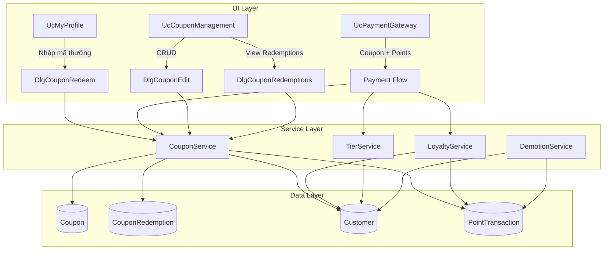

# Design Document: Loyalty Coupon System

## Overview

The Loyalty Coupon System extends CineManager's existing membership infrastructure with four major capabilities:

1. **Coupon Management** — Admin creates/manages reward codes that grant loyalty points
2. **Coupon Redemption** — Customers redeem codes from profile page or at checkout
3. **Points Economy** — Points-based discount at checkout (1 point = 1,000 VND), post-payment point accrual with tier multipliers
4. **Tier Lifecycle** — Automatic promotion based on spending thresholds, monthly demotion job for insufficient spending

The system integrates into the existing `Customer`, `PointTransaction`, and `Booking` entities, adds a new `Coupon` entity (distinct from the existing `Voucher` discount code system), and introduces a `CouponRedemption` junction table for tracking. The existing `Customer.TotalPoints` field is split into two separate fields: `LoyaltyPoints` (spendable) and `MembershipPoints` (for tier calculation).

### Key Design Decisions

| Decision | Rationale |
|----------|-----------|
| Separate `Coupon` from existing `Voucher` | Vouchers are percentage/fixed/free-ticket discounts on invoices. Coupons grant loyalty points — fundamentally different mechanics. |
| Split `TotalPoints` into `LoyaltyPoints` + `MembershipPoints` | Requirements distinguish spendable points from tier-determining points. A single field cannot serve both purposes. |
| `CouponRedemption` junction table | Enforces one-redemption-per-customer constraint at DB level and provides audit trail for admin tracking. |
| Demotion job as a service method (not Windows Service) | WinForms app — use a timer-based check on app startup or admin trigger rather than a separate background service. |
| Coupon discount at checkout converts points to VND | 1 point = 1,000 VND. Coupon applied at checkout adds points first, then those points can optionally be spent as discount. |

## Architecture



### Layer Responsibilities

- **UI Layer**: WinForms UserControls and Dialogs. Handles user interaction, validation feedback, and display.
- **Service Layer**: Business logic. `CouponService` handles coupon CRUD and redemption validation. `LoyaltyService` handles point accrual with tier multipliers. `TierService` handles promotion logic. `DemotionService` handles monthly demotion evaluation.
- **Data Layer**: EF Core with SQLite. New entities added to `AppDbContext` with proper relationships and constraints.

## Components and Interfaces

### New Services

#### CouponService

```csharp
public class CouponService
{
    // Admin operations
    Task<(bool Success, string Message, Coupon? Coupon)> CreateAsync(string code, int pointsAwarded, DateTime expirationDate, int maxRedemptions);
    Task<(bool Success, string Message)> UpdateAsync(int couponId, DateTime? expirationDate, int? maxRedemptions, bool? isActive);
    Task<List<Coupon>> GetAllAsync(bool? activeFilter = null, string? searchCode = null);
    Task<Coupon?> GetByIdAsync(int id);
    Task<List<CouponRedemption>> GetRedemptionsAsync(int couponId);

    // Customer operations
    Task<(bool Success, string Message, int PointsAwarded)> RedeemAsync(int customerId, string code);
    Task<(bool Success, string Message, int PointsAwarded)> ValidateForCheckoutAsync(int customerId, string code);
}
```

#### LoyaltyService (replaces/extends existing PointService)

```csharp
public class LoyaltyService
{
    // Post-payment accrual
    Task<(int LoyaltyEarned, int MembershipEarned)> AccruePointsAsync(int customerId, decimal paymentAmount, int? invoiceId);

    // Points discount
    Task<(bool Success, string Message, decimal DiscountAmount)> RedeemPointsForDiscountAsync(int customerId, int pointsToRedeem, decimal orderTotal);

    // Query
    Task<int> GetLoyaltyBalanceAsync(int customerId);
    Task<List<PointTransaction>> GetHistoryAsync(int customerId);
}
```

#### TierService

```csharp
public class TierService
{
    Task<(bool Promoted, string? NewTier)> EvaluatePromotionAsync(int customerId);
    decimal GetMultiplier(string tier);
}
```

#### DemotionService

```csharp
public class DemotionService
{
    Task<List<(int CustomerId, string OldTier, string NewTier)>> ExecuteMonthlyDemotionAsync();
    Task<bool> ShouldRunAsync(); // Check if demotion already ran this month
}
```

### New UI Components

| Component | Type | Location | Purpose |
|-----------|------|----------|---------|
| `DlgCouponRedeem` | Dialog Form | Forms/Customer/ | Text input for coupon code entry |
| `UcCouponManagement` | UserControl | Forms/Admin/Coupons/ | Paginated coupon list with CRUD |
| `DlgCouponEdit` | Dialog Form | Forms/Admin/Coupons/ | Create/edit coupon form |
| `DlgCouponRedemptions` | Dialog Form | Forms/Admin/Coupons/ | View redemption history per coupon |

### Modified Components

| Component | Changes |
|-----------|---------|
| `UcMyProfile` | Add "Nhập mã thưởng" button, show LoyaltyPoints and MembershipPoints separately |
| `UcPaymentGateway` | Replace placeholder voucher field with coupon input + points redemption UI |
| `CustomerService` | Update to use new `LoyaltyPoints`/`MembershipPoints` fields |
| `PointService` | Deprecated — replaced by `LoyaltyService` |
| `AppDbContext` | Add `Coupons`, `CouponRedemptions` DbSets and configuration |

## Data Models

### New Entity: Coupon

```csharp
public class Coupon
{
    public int Id { get; set; }
    public string Code { get; set; } = string.Empty;       // Unique, e.g. "REWARD2026"
    public int PointsAwarded { get; set; }                  // Points granted on redemption
    public DateTime ExpirationDate { get; set; }            // Must be in the future at creation
    public int MaxRedemptions { get; set; }                 // Max number of unique customers
    public int UsedCount { get; set; } = 0;                 // Current redemption count
    public bool IsActive { get; set; } = true;              // Admin can deactivate
    public DateTime CreatedAt { get; set; } = DateTime.Now;

    // Navigation
    public ICollection<CouponRedemption> Redemptions { get; set; } = new List<CouponRedemption>();
}
```

### New Entity: CouponRedemption

```csharp
public class CouponRedemption
{
    public int Id { get; set; }
    public int CouponId { get; set; }
    public int CustomerId { get; set; }
    public DateTime RedeemedAt { get; set; } = DateTime.Now;

    // Navigation
    public Coupon Coupon { get; set; } = null!;
    public Customer Customer { get; set; } = null!;
}
```

### Modified Entity: Customer

```csharp
public class Customer
{
    // ... existing fields ...
    
    // CHANGED: Split TotalPoints into two fields
    public int LoyaltyPoints { get; set; } = 0;      // Spendable points (from coupons + payments)
    public int MembershipPoints { get; set; } = 0;    // Tier-determining points (from payments only)
    
    // DEPRECATED: TotalPoints (migrate data to LoyaltyPoints, keep for backward compat)
    public int TotalPoints { get; set; } = 0;
    
    // NEW: Track monthly spending for demotion
    public decimal MonthlySpent { get; set; } = 0;    // Reset monthly by demotion job
    
    // NEW: Navigation
    public ICollection<CouponRedemption> CouponRedemptions { get; set; } = new List<CouponRedemption>();
}
```

### Database Schema Changes (Migration)

```sql
-- New tables
CREATE TABLE Coupons (
    Id INTEGER PRIMARY KEY AUTOINCREMENT,
    Code TEXT NOT NULL UNIQUE,
    PointsAwarded INTEGER NOT NULL,
    ExpirationDate TEXT NOT NULL,
    MaxRedemptions INTEGER NOT NULL,
    UsedCount INTEGER NOT NULL DEFAULT 0,
    IsActive INTEGER NOT NULL DEFAULT 1,
    CreatedAt TEXT NOT NULL
);

CREATE TABLE CouponRedemptions (
    Id INTEGER PRIMARY KEY AUTOINCREMENT,
    CouponId INTEGER NOT NULL REFERENCES Coupons(Id),
    CustomerId INTEGER NOT NULL REFERENCES Customers(Id),
    RedeemedAt TEXT NOT NULL,
    UNIQUE(CouponId, CustomerId)  -- One redemption per customer per coupon
);

-- Customer table changes
ALTER TABLE Customers ADD COLUMN LoyaltyPoints INTEGER NOT NULL DEFAULT 0;
ALTER TABLE Customers ADD COLUMN MembershipPoints INTEGER NOT NULL DEFAULT 0;
ALTER TABLE Customers ADD COLUMN MonthlySpent REAL NOT NULL DEFAULT 0;

-- Data migration: copy TotalPoints to LoyaltyPoints
UPDATE Customers SET LoyaltyPoints = TotalPoints;
```

### EF Core Configuration

```csharp
// In AppDbContext.OnModelCreating
modelBuilder.Entity<Coupon>()
    .HasIndex(c => c.Code).IsUnique();

modelBuilder.Entity<CouponRedemption>()
    .HasIndex(cr => new { cr.CouponId, cr.CustomerId }).IsUnique();

modelBuilder.Entity<CouponRedemption>()
    .HasOne(cr => cr.Coupon)
    .WithMany(c => c.Redemptions)
    .HasForeignKey(cr => cr.CouponId);

modelBuilder.Entity<CouponRedemption>()
    .HasOne(cr => cr.Customer)
    .WithMany(c => c.CouponRedemptions)
    .HasForeignKey(cr => cr.CustomerId);
```

### Tier Thresholds and Multipliers

| Tier | Promotion Threshold (TotalSpent) | Monthly Spending Minimum | Loyalty Multiplier |
|------|----------------------------------|--------------------------|-------------------|
| Standard | — | — | 1.0x |
| VIP | ≥ 2,000,000 VND | 200,000 VND | 1.5x |
| Diamond | ≥ 10,000,000 VND | 500,000 VND | 2.0x |

### Point Economy

| Operation | Rate | Affects |
|-----------|------|---------|
| Payment accrual | 1 point per 10,000 VND | Both LoyaltyPoints and MembershipPoints |
| Tier multiplier | 1x / 1.5x / 2x | LoyaltyPoints only |
| Coupon redemption | Coupon.PointsAwarded | LoyaltyPoints only |
| Points discount | 1 point = 1,000 VND | Deducts from LoyaltyPoints |

## Correctness Properties

*A property is a characteristic or behavior that should hold true across all valid executions of a system — essentially, a formal statement about what the system should do. Properties serve as the bridge between human-readable specifications and machine-verifiable correctness guarantees.*

### Property 1: Coupon Creation Rejects Invalid Parameters

*For any* coupon creation request where the expiration date is in the past OR the maximum redemption count is less than 1, the system SHALL reject the creation and return an error, leaving the coupon table unchanged.

**Validates: Requirements 1.3, 1.4**

### Property 2: Coupon Code Uniqueness

*For any* existing coupon with code C, attempting to create a new coupon with the same code C SHALL fail, regardless of other parameters.

**Validates: Requirements 1.2**

### Property 3: Coupon Code Immutability

*For any* coupon after creation, the code field SHALL remain unchanged regardless of any update operations performed on the coupon.

**Validates: Requirements 2.2**

### Property 4: Coupon Validation Rejects Invalid Redemptions

*For any* coupon redemption attempt, if the coupon code does not exist, OR the coupon is inactive, OR the coupon is expired, OR the coupon has reached max redemptions, OR the customer has already redeemed this coupon, the system SHALL reject the redemption and return the appropriate error message without modifying any balances.

**Validates: Requirements 2.3, 3.4, 3.5, 3.6, 3.7, 3.8, 4.5**

### Property 5: Successful Coupon Redemption Completeness

*For any* valid coupon with P points and any eligible customer, after successful redemption: (a) the customer's LoyaltyPoints increases by exactly P, (b) a PointTransaction with Type="Earn" referencing the coupon code is created, (c) a CouponRedemption record with correct CustomerId, CouponId, and timestamp exists, and (d) the coupon's UsedCount increases by exactly 1.

**Validates: Requirements 3.2, 3.3, 4.3, 4.4, 10.1, 10.3**

### Property 6: One Redemption Per Customer Per Coupon

*For any* customer-coupon pair where a redemption already exists, a second redemption attempt SHALL fail without modifying any state.

**Validates: Requirements 3.5, 10.2**

### Property 7: Post-Payment Loyalty Accrual with Tier Multiplier

*For any* successful payment of amount A by a customer with tier T, the LoyaltyPoints earned SHALL equal floor(floor(A / 10,000) × multiplier(T)) where multiplier is 1.0 for Standard, 1.5 for VIP, and 2.0 for Diamond.

**Validates: Requirements 6.1, 8.1, 8.2, 8.3**

### Property 8: Post-Payment Membership Accrual and Spending Update

*For any* successful payment of amount A, the customer's MembershipPoints SHALL increase by exactly floor(A / 10,000) (no tier multiplier), and TotalSpent SHALL increase by exactly A.

**Validates: Requirements 6.2, 6.4**

### Property 9: Points Discount Bounded by Balance and Order Total

*For any* points redemption request of N points with customer balance B and order total T, the system SHALL: reject if N > B, and if accepted, the actual discount SHALL equal min(N × 1,000, T) VND, and LoyaltyPoints SHALL decrease by the number of points actually consumed.

**Validates: Requirements 5.3, 5.4, 5.5, 5.6**

### Property 10: Tier Promotion at Spending Thresholds

*For any* customer, after a payment that causes TotalSpent to reach or exceed 2,000,000 VND (from Standard) or 10,000,000 VND (from VIP), the customer's tier SHALL be promoted to VIP or Diamond respectively.

**Validates: Requirements 7.1, 7.2**

### Property 11: Monthly Demotion at Insufficient Spending

*For any* Diamond customer with monthly spending < 500,000 VND, the demotion job SHALL change their tier to "VIP". *For any* VIP customer with monthly spending < 200,000 VND, the demotion job SHALL change their tier to "Standard". A PointTransaction recording the demotion SHALL be created.

**Validates: Requirements 9.3, 9.4, 9.5**

### Property 12: Coupon Filter Correctness

*For any* set of coupons with mixed active status, filtering by active=true SHALL return only active coupons, and searching by a code substring SHALL return only coupons whose code contains that substring.

**Validates: Requirements 2.4**

## Error Handling

### Coupon Redemption Errors

| Condition | Error Message (Vietnamese) | HTTP-equivalent |
|-----------|---------------------------|-----------------|
| Code not found | "Mã không hợp lệ" | 404 |
| Already redeemed by customer | "Bạn đã sử dụng mã này rồi" | 409 |
| Max redemptions reached | "Mã đã hết lượt sử dụng" | 410 |
| Coupon expired | "Mã đã hết hạn" | 410 |
| Coupon inactive | "Mã không còn hoạt động" | 403 |

### Coupon Creation Errors

| Condition | Error Message |
|-----------|---------------|
| Duplicate code | "Mã coupon đã tồn tại" |
| Past expiration date | "Ngày hết hạn phải ở tương lai" |
| Max redemptions < 1 | "Số lượt sử dụng tối thiểu là 1" |

### Points Redemption Errors

| Condition | Error Message |
|-----------|---------------|
| Insufficient balance | "Không đủ điểm! Bạn có {balance} điểm." |
| Points exceed order total | Auto-cap to order total (no error, just limit) |
| Zero or negative points | "Số điểm đổi phải lớn hơn 0" |

### Concurrency Handling

- **Coupon UsedCount**: Use optimistic concurrency (EF Core concurrency token) to prevent race conditions when multiple customers redeem simultaneously.
- **Customer points balance**: Wrap point modifications in a transaction to ensure atomicity.
- **Demotion job**: Use a `LastDemotionRun` timestamp to prevent duplicate execution.

## Testing Strategy

### Property-Based Testing

**Library**: [FsCheck](https://fscheck.github.io/FsCheck/) with xUnit integration (`FsCheck.Xunit`)

**Configuration**: Minimum 100 iterations per property test.

**Tag format**: `Feature: loyalty-coupon-system, Property {number}: {property_text}`

Property-based tests will cover:
- Point calculation logic (accrual, multipliers, conversion)
- Coupon validation logic (all rejection conditions)
- Tier promotion/demotion threshold logic
- Points discount bounding logic

### Unit Tests (Example-Based)

Unit tests will cover:
- Specific UI interactions (dialog opens, fields display correctly)
- Coupon CRUD operations with concrete examples
- Integration between services (payment flow end-to-end)
- Edge cases: zero-amount payments, exactly-at-threshold promotions

### Integration Tests

Integration tests will cover:
- Full payment flow: booking → payment → point accrual → tier check
- Coupon redemption from profile page end-to-end
- Demotion job execution with real database state
- Concurrent redemption scenarios

### Test Organization

```
BaiTapLon.Tests/
├── Properties/
│   ├── CouponValidationProperties.cs    (Properties 1-6)
│   ├── PointCalculationProperties.cs    (Properties 7-9)
│   ├── TierLifecycleProperties.cs       (Properties 10-11)
│   └── CouponFilterProperties.cs        (Property 12)
├── Unit/
│   ├── CouponServiceTests.cs
│   ├── LoyaltyServiceTests.cs
│   ├── TierServiceTests.cs
│   └── DemotionServiceTests.cs
└── Integration/
    ├── PaymentFlowTests.cs
    └── RedemptionFlowTests.cs
```

