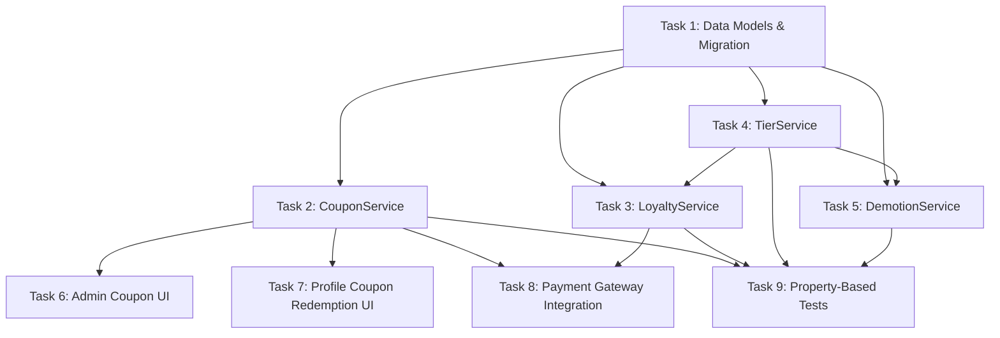

# Implementation Tasks: Loyalty Coupon System

## Task Dependency Graph

## Task 1: Data Models & Database Migration

- [x] Create `Models/Customers/Coupon.cs` with fields: `Id`, `Code` (unique string), `PointsAwarded` (int), `ExpirationDate` (DateTime), `MaxRedemptions` (int), `UsedCount` (int, default 0), `IsActive` (bool, default true), `CreatedAt` (DateTime). Add navigation property `ICollection<CouponRedemption> Redemptions`.
- [x] Create `Models/Customers/CouponRedemption.cs` with fields: `Id`, `CouponId` (int), `CustomerId` (int), `RedeemedAt` (DateTime). Add navigation properties `Coupon Coupon` and `Customer Customer`.
- [x] Modify `Models/Customers/Customer.cs`: Add `LoyaltyPoints` (int, default 0), `MembershipPoints` (int, default 0), `MonthlySpent` (decimal, default 0). Add navigation property `ICollection<CouponRedemption> CouponRedemptions`. Keep existing `TotalPoints` for backward compatibility.
- [x] Update `Data/AppDbContext.cs`: Add `DbSet<Coupon> Coupons` and `DbSet<CouponRedemption> CouponRedemptions`. In `OnModelCreating`, configure unique index on `Coupon.Code`, composite unique index on `CouponRedemption(CouponId, CustomerId)`, relationships between `CouponRedemption` → `Coupon` and `CouponRedemption` → `Customer`, and precision for `Customer.MonthlySpent` (14, 2).
- [x] Create EF Core migration: Run `dotnet ef migrations add AddLoyaltyCouponSystem`. The migration should add the `Coupons` and `CouponRedemptions` tables, add `LoyaltyPoints`, `MembershipPoints`, `MonthlySpent` columns to `Customers`, and include a data migration step: `UPDATE Customers SET LoyaltyPoints = TotalPoints`.
- [x] Apply migration: Run `dotnet ef database update` to apply schema changes.

### Acceptance Criteria Validated
- Requirements 1.1 (Coupon fields), 10.1 (Redemption record), 10.2 (unique constraint per customer-coupon)

---

## Task 2: CouponService — CRUD & Redemption Logic

- [x] Create `Services/Customers/CouponService.cs` with constructor accepting `AppDbContext`.
- [x] Implement `CreateAsync(string code, int pointsAwarded, DateTime expirationDate, int maxRedemptions)` returning `(bool Success, string Message, Coupon? Coupon)`. Validate: code uniqueness (error: "Mã coupon đã tồn tại"), expiration date in future (error: "Ngày hết hạn phải ở tương lai"), maxRedemptions >= 1 (error: "Số lượt sử dụng tối thiểu là 1"). On success, create and save the Coupon entity.
- [x] Implement `UpdateAsync(int couponId, DateTime? expirationDate, int? maxRedemptions, bool? isActive)` returning `(bool Success, string Message)`. Prevent code modification. Apply only non-null parameter changes.
- [x] Implement `GetAllAsync(bool? activeFilter, string? searchCode)` returning `List<Coupon>`. Support filtering by `IsActive` and searching by code substring (case-insensitive).
- [x] Implement `GetByIdAsync(int id)` returning `Coupon?` with eager-loaded `Redemptions`.
- [x] Implement `GetRedemptionsAsync(int couponId)` returning `List<CouponRedemption>` with included `Customer` navigation for display.
- [x] Implement `RedeemAsync(int customerId, string code)` returning `(bool Success, string Message, int PointsAwarded)`. Validation order: (1) code exists → "Mã không hợp lệ", (2) coupon is active → "Mã không còn hoạt động", (3) not expired → "Mã đã hết hạn", (4) UsedCount < MaxRedemptions → "Mã đã hết lượt sử dụng", (5) customer hasn't redeemed → "Bạn đã sử dụng mã này rồi". On success: add points to `Customer.LoyaltyPoints`, create `PointTransaction(Type="Earn", Description="Nhập mã thưởng: {code}")`, create `CouponRedemption` record, increment `Coupon.UsedCount`. Wrap in transaction.
- [x] Implement `ValidateForCheckoutAsync(int customerId, string code)` — same validation as `RedeemAsync` but does NOT commit changes. Returns points that would be awarded for UI preview.

### Acceptance Criteria Validated
- Requirements 1.1–1.5 (Coupon CRUD), 2.1–2.4 (Coupon management), 3.2–3.8 (Profile redemption validation), 4.2–4.5 (Checkout validation), 10.1–10.3 (Tracking)

---

## Task 3: LoyaltyService — Point Accrual & Discount

- [x] Create `Services/Customers/LoyaltyService.cs` with constructor accepting `AppDbContext` and `TierService`.
- [x] Implement `AccruePointsAsync(int customerId, decimal paymentAmount, int? invoiceId)` returning `(int LoyaltyEarned, int MembershipEarned)`. Calculate base points = `floor(paymentAmount / 10,000)`. Get tier multiplier from `TierService.GetMultiplier()`. LoyaltyEarned = `floor(basePoints × multiplier)`. MembershipEarned = basePoints (no multiplier). Update `Customer.LoyaltyPoints += LoyaltyEarned`, `Customer.MembershipPoints += MembershipEarned`, `Customer.TotalSpent += paymentAmount`, `Customer.MonthlySpent += paymentAmount`. Create `PointTransaction(Type="Earn", Points=LoyaltyEarned)`. Call `TierService.EvaluatePromotionAsync()` after updating TotalSpent.
- [x] Implement `RedeemPointsForDiscountAsync(int customerId, int pointsToRedeem, decimal orderTotal)` returning `(bool Success, string Message, decimal DiscountAmount)`. Validate: pointsToRedeem > 0 (error: "Số điểm đổi phải lớn hơn 0"), pointsToRedeem <= Customer.LoyaltyPoints (error: "Không đủ điểm! Bạn có {balance} điểm."). Calculate discount = `min(pointsToRedeem × 1000, orderTotal)`. Actual points consumed = `ceil(discount / 1000)`. Deduct from `Customer.LoyaltyPoints`. Create `PointTransaction(Type="Redeem")`.
- [x] Implement `GetLoyaltyBalanceAsync(int customerId)` returning current `LoyaltyPoints`.
- [x] Implement `GetHistoryAsync(int customerId)` returning `List<PointTransaction>` ordered by `CreatedAt` descending.

### Acceptance Criteria Validated
- Requirements 5.1–5.6 (Points discount), 6.1–6.4 (Post-payment accrual), 8.1–8.3 (Tier multipliers)

---

## Task 4: TierService — Promotion Logic

- [x] Create `Services/Customers/TierService.cs` with constructor accepting `AppDbContext`.
- [x] Implement `GetMultiplier(string tier)` returning `decimal`: "Standard" → 1.0m, "VIP" → 1.5m, "Diamond" → 2.0m.
- [x] Implement `EvaluatePromotionAsync(int customerId)` returning `(bool Promoted, string? NewTier)`. Load customer, check: if Tier == "Standard" and TotalSpent >= 2,000,000 → promote to "VIP". If Tier == "VIP" and TotalSpent >= 10,000,000 → promote to "Diamond". Save changes and return result.

### Acceptance Criteria Validated
- Requirements 7.1–7.3 (Tier promotion), 8.1–8.3 (Multiplier values)

---

## Task 5: DemotionService — Monthly Tier Demotion

- [x] Create `Services/Customers/DemotionService.cs` with constructor accepting `AppDbContext`.
- [x] Implement `ShouldRunAsync()` returning `bool`. Check if demotion has already run this month by looking for a `PointTransaction` with Type="Demotion" and `CreatedAt` in the current month.
- [x] Implement `ExecuteMonthlyDemotionAsync()` returning `List<(int CustomerId, string OldTier, string NewTier)>`. Query all active customers. For each "Diamond" customer with `MonthlySpent < 500,000`: demote to "VIP", create `PointTransaction(Type="Demotion", Description="Giáng hạng: Diamond → VIP (chi tiêu tháng không đủ)")`. For each "VIP" customer with `MonthlySpent < 200,000`: demote to "Standard", create similar PointTransaction. After processing, reset `MonthlySpent = 0` for all customers. Save all changes.
- [x] Integrate demotion check: In `FrmMain.cs` or `FrmCustomerMain.cs` load event, call `DemotionService.ShouldRunAsync()` and if true, execute `ExecuteMonthlyDemotionAsync()` on the 1st of each month.

### Acceptance Criteria Validated
- Requirements 9.1–9.5 (Monthly demotion)

---

## Task 6: Admin Coupon Management UI

- [x] Create folder `Forms/Admin/Coupons/`.
- [x] Create `Forms/Admin/Coupons/UcCouponManagement.cs` as a `UserControl`. Layout: top toolbar with search TextBox (placeholder "Tìm mã coupon..."), active/inactive filter ComboBox, and "Tạo mới" (Create) button. Main area: DataGridView with columns — Code, Points Awarded, Expiration Date, Max Redemptions, Used Count, Active Status. Bottom: `AdminPaginationBar` for paging. Use `AdminTheme` colors and `AdminLayouts` patterns consistent with other admin screens.
- [x] Wire `UcCouponManagement` to `CouponService.GetAllAsync()` with filter/search parameters. Implement pagination (page size 15). Double-click row opens `DlgCouponEdit` in edit mode. "Tạo mới" button opens `DlgCouponEdit` in create mode. Right-click context menu with "Xem lượt đổi" (View Redemptions) opens `DlgCouponRedemptions`.
- [x] Create `Forms/Admin/Coupons/DlgCouponEdit.cs` as a `Form` dialog. Fields: Code (TextBox, disabled in edit mode), Points Awarded (NumericUpDown), Expiration Date (DateTimePicker), Max Redemptions (NumericUpDown), Active (CheckBox). Buttons: Save, Cancel. On save, call `CouponService.CreateAsync()` or `CouponService.UpdateAsync()`. Display validation errors from service.
- [x] Create `Forms/Admin/Coupons/DlgCouponRedemptions.cs` as a `Form` dialog. Display DataGridView with columns: Customer Name, Customer Email, Redeemed At. Load data from `CouponService.GetRedemptionsAsync()`.
- [x] Register `UcCouponManagement` in the admin navigation (sidebar in `FrmMain.cs`) with label "Coupon" and appropriate icon.

### Acceptance Criteria Validated
- Requirements 1.5 (Paginated list), 2.1–2.4 (Edit/deactivate/filter), 10.4 (View redemptions)

---

## Task 7: Profile Page — Coupon Redemption Dialog

- [x] Modify `Forms/Customer/UcMyProfile.cs`: Add a "Nhập mã thưởng" button in the profile section. Display `LoyaltyPoints` and `MembershipPoints` separately (replace single TotalPoints display). Show current tier with visual indicator.
- [x] Create `Forms/Customer/DlgCouponRedeem.cs` as a `Form` dialog. Layout: Label "Nhập mã thưởng", TextBox for code input, "Xác nhận" (Confirm) button, "Hủy" (Cancel) button. On confirm: call `CouponService.RedeemAsync()`. On success: show success message with points earned, close dialog. On failure: show error message from service (keep dialog open for retry).
- [x] Wire the "Nhập mã thưởng" button in `UcMyProfile` to open `DlgCouponRedeem` with the current customer's ID. After dialog closes with success, refresh the profile display to show updated points.

### Acceptance Criteria Validated
- Requirements 3.1–3.8 (Profile redemption flow)

---

## Task 8: Payment Gateway — Coupon & Points Integration

- [x] Modify `Forms/Customer/UcPaymentGateway.cs`: Add a "Mã thưởng" (Reward Code) section with TextBox and "Áp dụng" (Apply) button. Add a "Dùng điểm" (Use Points) section showing current LoyaltyPoints balance, NumericUpDown for points to redeem, and live discount preview label (format: "-{discount:N0}đ").
- [x] Implement coupon apply logic: On "Áp dụng" click, call `CouponService.ValidateForCheckoutAsync()`. On success: display points to be earned, show equivalent discount preview, store coupon code in booking state. On failure: show error message, clear input.
- [x] Implement points discount logic: On points value change, calculate discount = `min(points × 1000, orderTotal)`. Update the order total display in real-time. Validate that points don't exceed balance (cap NumericUpDown max to LoyaltyPoints balance).
- [x] Implement "Xóa mã" (Remove Code) button to clear applied coupon and reset discount.
- [x] Modify payment completion flow: After successful payment, call `CouponService.RedeemAsync()` if a coupon was applied. Call `LoyaltyService.AccruePointsAsync()` with the payment amount. Call `LoyaltyService.RedeemPointsForDiscountAsync()` if points were used. Update `CustomerBookingState` to carry coupon/points data through the flow.

### Acceptance Criteria Validated
- Requirements 4.1–4.6 (Checkout coupon), 5.1–5.6 (Points discount), 6.1–6.4 (Post-payment accrual), 7.1–7.3 (Tier promotion after payment)

---

## Task 9: Property-Based Tests

- [x] Create test project `BaiTapLon.Tests` with xUnit, FsCheck, and FsCheck.Xunit packages. Add project reference to `BaiTapLon`. Configure test project in solution.
- [x] Create `BaiTapLon.Tests/Properties/CouponValidationProperties.cs`. Implement Property 1 (creation rejects invalid params): generate arbitrary past dates and maxRedemptions < 1, assert CreateAsync fails. Implement Property 2 (code uniqueness): create coupon, attempt duplicate, assert failure. Implement Property 3 (code immutability): create coupon, attempt update with code change, assert code unchanged. Implement Property 4 (invalid redemption rejection): generate scenarios for each rejection condition, assert RedeemAsync fails without state change. Implement Property 5 (successful redemption completeness): for valid coupon+customer, assert all four post-conditions hold. Implement Property 6 (one redemption per customer): redeem once, attempt again, assert failure.
- [x] Create `BaiTapLon.Tests/Properties/PointCalculationProperties.cs`. Implement Property 7 (loyalty accrual with tier multiplier): for arbitrary amounts and tiers, assert `LoyaltyEarned == floor(floor(amount/10000) × multiplier)`. Implement Property 8 (membership accrual): assert `MembershipEarned == floor(amount/10000)` and `TotalSpent += amount`. Implement Property 9 (points discount bounded): for arbitrary points/balance/orderTotal, assert discount <= balance×1000 and discount <= orderTotal.
- [x] Create `BaiTapLon.Tests/Properties/TierLifecycleProperties.cs`. Implement Property 10 (promotion at thresholds): for arbitrary spending sequences, assert correct tier after each payment. Implement Property 11 (monthly demotion): for arbitrary monthly spending below thresholds, assert correct demotion.
- [x] Create `BaiTapLon.Tests/Properties/CouponFilterProperties.cs`. Implement Property 12 (filter correctness): generate mixed active/inactive coupons, assert filter returns only matching items.
- [x] Use in-memory SQLite database for test isolation. Tag all tests with `[Trait("Feature", "loyalty-coupon-system")]` and appropriate property number.

### Acceptance Criteria Validated
- All 12 Correctness Properties from design document
