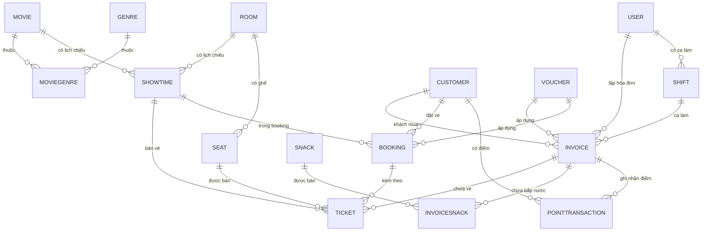

# 📊 CineManager - Database Architecture & Data Flow

**Ngày tạo:** 4 May 2026  
**Trạng thái:** Phase 1-5.5 Complete + Phase 7-13 Prepared  
**Mục đích:** Tài liệu toàn bộ cấu trúc database, mối quan hệ, ràng buộc, và luồng dữ liệu

---

## 📑 Mục Lục

1. [Tổng Quan Database](#tổng-quan-database)
2. [Entity Models Chi Tiết](#entity-models-chi-tiết)
3. [Mối Quan Hệ Giữa Entities](#mối-quan-hệ-giữa-entities)
4. [Ràng Buộc & Quy Tắc Nghiệp Vụ](#ràng-buộc--quy-tắc-nghiệp-vụ)
5. [Luồng Dữ Liệu Chính](#luồng-dữ-liệu-chính)
6. [Biểu Đồ ER (Entity Relationship)](#biểu-đồ-er)
7. [Migrations & Versioning](#migrations--versioning)
8. [Performance & Indexing](#performance--indexing)

---

## 🎯 Tổng Quan Database

### Thông Tin Cơ Bản

- **Database Server:** SQL Server LocalDB (`(localdb)\MSSQLLocalDB`)
- **Database Name:** `CinemaManagement`
- **ORM:** Entity Framework Core 10.0.7
- **Architecture:** 3-Layer (Presentation → Services → DbContext)
- **Số Entities:** 16 entities (11 Phase 1-5.5, 5 Phase 7-13)

### Phân Loại Entities

| Danh Mục                        | Entities                        | Số Lượng | Giai Đoạn   |
| ------------------------------- | ------------------------------- | -------- | ----------- |
| **🏢 Quản Lý Rạp**              | Room, Seat                      | 2        | Phase 2     |
| **🎬 Quản Lý Phim**             | Movie, Genre, MovieGenre, Snack | 4        | Phase 2, 5  |
| **⏰ Lịch Chiếu**               | Showtime                        | 1        | Phase 2     |
| **👤 Nhân Viên & Bảo Mật**      | User, Shift                     | 2        | Phase 1, 11 |
| **💳 Bán Hàng & Hóa Đơn**       | Invoice, Ticket, InvoiceSnack   | 3        | Phase 3-5.5 |
| **👥 Khách Hàng & Thành Viên**  | Customer                        | 1        | Phase 7     |
| **🎁 Khuyến Mãi & Điểm Thưởng** | Voucher, PointTransaction       | 2        | Phase 10, 8 |
| **📦 Đặt Hàng Online**          | Booking                         | 1        | Phase 9     |

---

## 📋 Entity Models Chi Tiết

### 1️⃣ USER (Nhân Viên & Quản Trị)

**Location:** `Models/Identity/User.cs`

```
┌─────────────────────────────────┐
│           USER                  │
├─────────────────────────────────┤
│ Id (PK)                         │
│ FullName                        │
│ Username (UQ)                   │
│ PasswordHash (BCrypt)           │
│ Role (Admin|Staff)              │
│ Phone                           │
│ IsActive                        │
│ CreatedAt                       │
└─────────────────────────────────┘
```

| Trường       | Kiểu     | Mô Tả                | Ràng Buộc                |
| ------------ | -------- | -------------------- | ------------------------ |
| Id           | int      | Primary Key          | AUTO_INCREMENT           |
| FullName     | string   | Họ tên nhân viên     | Required, Max 100        |
| Username     | string   | Tên đăng nhập        | Required, Unique, Max 50 |
| PasswordHash | string   | Mật khẩu (BCrypt)    | Required, Fixed 60       |
| Role         | string   | Admin\|Staff         | Required                 |
| Phone        | string   | Số điện thoại        | Optional, Max 15         |
| IsActive     | bool     | Trạng thái hoạt động | Default: true            |
| CreatedAt    | DateTime | Ngày tạo             | Default: Now             |

**Quan hệ:**

- ➡️ Invoice (1:M) - Nhân viên lập nhiều hóa đơn
- ➡️ Shift (1:M) - Nhân viên có nhiều ca làm việc

**Seed Data (Khởi Tạo):**

```csharp
Username: admin | FullName: Administrator | Role: Admin | Password: admin123
Username: staff | FullName: Staff Member | Role: Staff | Password: staff123
```

---

### 2️⃣ GENRE (Thể Loại Phim)

**Location:** `Models/Catalog/Genre.cs`

```
┌──────────────────┐
│     GENRE        │
├──────────────────┤
│ Id (PK)          │
│ Name             │
└──────────────────┘
```

| Trường | Kiểu   | Mô Tả                                     |
| ------ | ------ | ----------------------------------------- |
| Id     | int    | Primary Key                               |
| Name   | string | Tên thể loại (Comedy, Drama, Action, ...) |

**Seed Data:**

- Action, Comedy, Drama, Horror, Romance, Animation, Documentary, Sci-Fi, Thriller, Crime

**Quan hệ:**

- ⬅️ MovieGenre (1:M) - Một thể loại có nhiều phim

---

### 3️⃣ MOVIE (Phim)

**Location:** `Models/Catalog/Movie.cs`

```
┌────────────────────────────────────────┐
│            MOVIE                       │
├────────────────────────────────────────┤
│ Id (PK)                                │
│ Code (UQ) - "MV001", "MV002"           │
│ Title                                  │
│ Director                               │
│ Actors                                 │
│ Duration (phút)                        │
│ AgeRating (P, C13, C16, C18)           │
│ Description                            │
│ Poster (byte[])                        │
│ PosterPath                             │
│ TrailerUrl                             │
│ IsActive                               │
│ ReleaseDate                            │
│ CreatedAt                              │
└────────────────────────────────────────┘
```

| Trường      | Kiểu     | Mô Tả                  | Ràng Buộc          |
| ----------- | -------- | ---------------------- | ------------------ |
| Id          | int      | Primary Key            | AUTO_INCREMENT     |
| Code        | string   | Mã phim                | Unique, Max 20     |
| Title       | string   | Tên phim               | Required, Max 255  |
| Director    | string   | Đạo diễn               | Optional           |
| Actors      | string   | Diễn viên              | Optional           |
| Duration    | int      | Thời lượng (phút)      | Min 30, Max 240    |
| AgeRating   | string   | Nhóm tuổi              | P\|C13\|C16\|C18   |
| Description | string   | Mô tả                  | Optional, Max 1000 |
| Poster      | byte[]   | Ảnh poster (binary)    | Optional           |
| PosterPath  | string   | Đường dẫn poster       | Optional, Max 260  |
| TrailerUrl  | string   | Link trailer YouTube   | Optional           |
| IsActive    | bool     | Đang chiếu             | Default: true      |
| ReleaseDate | DateTime | Ngày phát hành         | Optional           |
| CreatedAt   | DateTime | Ngày thêm vào hệ thống | Default: Now       |

**Quan hệ:**

- ➡️ MovieGenre (1:M) - Phim có nhiều thể loại
- ➡️ Showtime (1:M) - Phim có nhiều lịch chiếu

**Ví dụ Dữ Liệu:**

```
Code: MV001 | Title: Inception | Duration: 148 min | AgeRating: C13 | Director: Christopher Nolan
Code: MV002 | Title: The Matrix | Duration: 136 min | AgeRating: C16 | Director: Wachowski Sisters
```

---

### 4️⃣ MOVIEGENRE (Mối Quan Hệ Phim-Thể Loại)

**Location:** `Models/Catalog/MovieGenre.cs`

```
┌─────────────────────────┐
│    MOVIEGENRE           │
├─────────────────────────┤
│ MovieId (PK, FK)        │
│ GenreId (PK, FK)        │
└─────────────────────────┘
```

| Trường  | Kiểu | Mô Tả                  |
| ------- | ---- | ---------------------- |
| MovieId | int  | Foreign Key → Movie.Id |
| GenreId | int  | Foreign Key → Genre.Id |

**Khóa Chính:** `(MovieId, GenreId)` - Composite Key

**Quan hệ:**

- ⬅️ Movie (M:1) - Một phim
- ⬅️ Genre (M:1) - Một thể loại

**Ví dụ:**

```
MovieId: 1 (Inception), GenreId: 5 (Sci-Fi)
MovieId: 1 (Inception), GenreId: 8 (Thriller)
MovieId: 1 (Inception), GenreId: 1 (Action)
```

---

### 5️⃣ ROOM (Phòng Chiếu)

**Location:** `Models/Seating/Room.cs`

```
┌──────────────────────────────────┐
│          ROOM                    │
├──────────────────────────────────┤
│ Id (PK)                          │
│ Name                             │
│ Type (2D|3D|IMAX)                │
│ TotalSeats                       │
│ Rows                             │
│ Columns                          │
│ IsActive                         │
└──────────────────────────────────┘
```

| Trường     | Kiểu   | Mô Tả                             |
| ---------- | ------ | --------------------------------- |
| Id         | int    | Primary Key                       |
| Name       | string | Tên phòng (Phòng A, Phòng B, ...) |
| Type       | string | Loại phòng 2D\|3D\|IMAX           |
| TotalSeats | int    | Tổng ghế                          |
| Rows       | int    | Số hàng ghế (A-Z)                 |
| Columns    | int    | Số cột ghế                        |
| IsActive   | bool   | Phòng đang sử dụng                |

**Quan hệ:**

- ➡️ Seat (1:M) - Phòng có nhiều ghế
- ➡️ Showtime (1:M) - Phòng có nhiều lịch chiếu

**Ví dụ:**

```
Id: 1 | Name: Phòng A | Type: 3D | TotalSeats: 120 | Rows: 10 | Columns: 12
Id: 2 | Name: Phòng B | Type: 2D | TotalSeats: 80 | Rows: 8 | Columns: 10
```

---

### 6️⃣ SEAT (Ghế Ngồi)

**Location:** `Models/Seating/Seat.cs`

```
┌────────────────────────────────────────┐
│           SEAT                         │
├────────────────────────────────────────┤
│ Id (PK)                                │
│ RoomId (FK) → Room                     │
│ RowLabel (A-Z)                         │
│ SeatNumber (1-99)                      │
│ GridRow (vị trí grid)                  │
│ GridColumn (vị trí grid)               │
│ GridSpan (độ rộng cell)                │
│ Type (Standard|VIP|Couple)             │
│ PriceMultiplier (1.0, 1.5, 2.0)        │
└────────────────────────────────────────┘
```

| Trường          | Kiểu    | Mô Tả                             | Ràng Buộc             |
| --------------- | ------- | --------------------------------- | --------------------- |
| Id              | int     | Primary Key                       | AUTO_INCREMENT        |
| RoomId          | int     | FK → Room                         | Required              |
| RowLabel        | string  | Hàng (A, B, C, ...)               | Max 1                 |
| SeatNumber      | int     | Số ghế                            | 1-99                  |
| GridRow         | int     | Hàng grid (0-19)                  | Default: 0            |
| GridColumn      | int     | Cột grid (0-9)                    | Default: 0            |
| GridSpan        | int     | Độ rộng (1=bình thường, 2=couple) | Default: 1            |
| Type            | string  | Loại ghế                          | Standard\|VIP\|Couple |
| PriceMultiplier | decimal | Hệ số giá                         | Precision: 4,2        |

**Tính Toán:**

- `Label` = RowLabel + SeatNumber (e.g., "A1", "B5", "C10")
- `Actual Price` = BasePrice × PriceMultiplier

**Quan hệ:**

- ⬅️ Room (M:1) - Thuộc về phòng
- ➡️ Ticket (1:M) - Ghế có nhiều vé

**Ví dụ Layout (Phòng A, 10 hàng × 12 cột):**

```
Hàng A: A1(Standard×1.0), A2(Standard×1.0), ..., A10(Standard×1.0), [AISLE], A11(VIP×1.5), A12(VIP×1.5)
Hàng B: B1(Standard×1.0), B2(Standard×1.0), ..., B10(Standard×1.0), [AISLE], B11(Couple×2.0-span2)
...
```

---

### 7️⃣ SHOWTIME (Lịch Chiếu)

**Location:** `Models/Seating/Showtime.cs`

```
┌───────────────────────────────────────┐
│         SHOWTIME                      │
├───────────────────────────────────────┤
│ Id (PK)                               │
│ MovieId (FK) → Movie                  │
│ RoomId (FK) → Room                    │
│ StartTime                             │
│ EndTime (auto: StartTime+Duration+15) │
│ BasePrice                             │
│ IsActive                              │
└───────────────────────────────────────┘
```

| Trường    | Kiểu     | Mô Tả                     | Ràng Buộc       |
| --------- | -------- | ------------------------- | --------------- |
| Id        | int      | Primary Key               | AUTO_INCREMENT  |
| MovieId   | int      | FK → Movie                | Required        |
| RoomId    | int      | FK → Room                 | Required        |
| StartTime | DateTime | Thời gian bắt đầu         | Required        |
| EndTime   | DateTime | Thời gian kết thúc        | Auto-calc       |
| BasePrice | decimal  | Giá vé cơ bản             | Precision: 12,2 |
| IsActive  | bool     | Lịch chiếu đang hoạt động | Default: true   |

**Tính Toán EndTime:**

```
EndTime = StartTime + Movie.Duration + 15 phút buffer
VD: StartTime: 14:00 + Duration: 120 phút + 15 phút = 15:35
```

**Ràng Buộc Nghiệp Vụ:**

- ✅ Không được phép 2 lịch chiếu cùng phòng trong cùng thời gian (xem ShowtimeService.CheckTimeConflictAsync)
- ✅ Không được sửa/xóa lịch nếu đã bán vé
- ✅ EndTime phải > StartTime

**Quan hệ:**

- ⬅️ Movie (M:1)
- ⬅️ Room (M:1)
- ➡️ Ticket (1:M)
- ➡️ Booking (1:M)

**Ví dụ:**

```
Id: 101 | Movie: Inception | Room: A | StartTime: 2026-05-04 14:00 | EndTime: 15:35 | BasePrice: 120000
Id: 102 | Movie: Inception | Room: A | StartTime: 2026-05-04 16:00 | EndTime: 17:35 | BasePrice: 120000
```

---

### 8️⃣ INVOICE (Hóa Đơn)

**Location:** `Models/Sales/Invoice.cs`

```
┌──────────────────────────────────────────┐
│           INVOICE                        │
├──────────────────────────────────────────┤
│ Id (PK)                                  │
│ UserId (FK) → User (Nhân viên bán)       │
│ CustomerId (FK) → Customer (thành viên)  │
│ ShiftId (FK) → Shift (ca làm việc)       │
│ VoucherId (FK) → Voucher (mã giảm giá)   │
│ CustomerName                             │
│ CustomerPhone                            │
│ PaymentMethod (Cash|Card|Transfer|QR)    │
│ TotalAmount                              │
│ DiscountAmount                           │
│ ReceivedAmount                           │
│ ChangeAmount                             │
│ CreatedAt                                │
└──────────────────────────────────────────┘
```

| Trường         | Kiểu     | Mô Tả                  | Ràng Buộc                |
| -------------- | -------- | ---------------------- | ------------------------ |
| Id             | int      | Primary Key            | AUTO_INCREMENT           |
| UserId         | int      | FK → User              | Required                 |
| CustomerId     | int      | FK → Customer          | Nullable (Phase 8)       |
| ShiftId        | int      | FK → Shift             | Nullable (Phase 11)      |
| VoucherId      | int      | FK → Voucher           | Nullable (Phase 10)      |
| CustomerName   | string   | Tên KH                 | Nullable, Max 100        |
| CustomerPhone  | string   | SĐT KH                 | Nullable, Max 15         |
| PaymentMethod  | string   | Phương thức thanh toán | Cash\|Card\|Transfer\|QR |
| TotalAmount    | decimal  | Tổng tiền              | Precision: 12,2          |
| DiscountAmount | decimal  | Tiền giảm giá          | Precision: 12,2          |
| ReceivedAmount | decimal  | Tiền nhận từ KH        | Precision: 12,2          |
| ChangeAmount   | decimal  | Tiền thối              | Precision: 12,2          |
| CreatedAt      | DateTime | Thời gian lập hóa đơn  | Default: Now             |

**Tính Toán:**

```
TotalAmount = SUM(Ticket.Price) + SUM(InvoiceSnack.Quantity × Price) - DiscountAmount
ChangeAmount = ReceivedAmount - TotalAmount
```

**Ràng Buộc Nghiệp Vụ:**

- ✅ Transaction-safe: Sử dụng `DbConnection.BeginTransaction(IsolationLevel.Serializable)`
- ✅ Race condition prevention: Unique index (ShowtimeId, SeatId) trên Ticket
- ✅ UserId bắt buộc (nhân viên lập hóa đơn)
- ✅ Nếu CustomerId → tự động cộng điểm thưởng (Phase 8)

**Quan hệ:**

- ⬅️ User (M:1) - Một nhân viên lập nhiều hóa đơn
- ⬅️ Customer (M:1) - Một khách thành viên có nhiều hóa đơn
- ⬅️ Shift (M:1) - Một ca làm có nhiều hóa đơn
- ⬅️ Voucher (M:1)
- ➡️ Ticket (1:M) - Một hóa đơn có nhiều vé
- ➡️ InvoiceSnack (1:M) - Một hóa đơn có nhiều đồ ăn
- ➡️ PointTransaction (1:M) - Ghi nhận điểm thưởng

**Ví dụ:**

```
Id: 1001 | UserId: 2 (Staff) | PaymentMethod: Cash
  → Tickets: [A1/Showtime#101/120000, B2/Showtime#101/150000]
  → Snacks: [Popcorn×2/25000, Coke×1/15000]
  → TotalAmount: 120000 + 150000 + 50000 + 15000 = 335000 VND
  → DiscountAmount: 0
  → ReceivedAmount: 350000
  → ChangeAmount: 15000

Id: 1002 | UserId: 2 | CustomerId: 5 | PaymentMethod: Card
  → Tương tự, nhưng ghi nhận điểm thưởng cho customer
```

---

### 9️⃣ TICKET (Vé)

**Location:** `Models/Sales/Ticket.cs`

```
┌──────────────────────────────────────┐
│          TICKET                      │
├──────────────────────────────────────┤
│ Id (PK)                              │
│ ShowtimeId (FK) → Showtime           │
│ SeatId (FK) → Seat                   │
│ InvoiceId (FK) → Invoice             │
│ BookingId (FK) → Booking (nullable)  │
│ Price                                │
│ [UQ] (ShowtimeId, SeatId)            │
└──────────────────────────────────────┘
```

| Trường     | Kiểu    | Mô Tả                                     | Ràng Buộc          |
| ---------- | ------- | ----------------------------------------- | ------------------ |
| Id         | int     | Primary Key                               | AUTO_INCREMENT     |
| ShowtimeId | int     | FK → Showtime                             | Required           |
| SeatId     | int     | FK → Seat                                 | Required           |
| InvoiceId  | int     | FK → Invoice                              | Required           |
| BookingId  | int     | FK → Booking                              | Nullable (Phase 9) |
| Price      | decimal | Giá vé = BasePrice × Seat.PriceMultiplier | Precision: 12,2    |

**Khóa Duy Nhất:**

```
UNIQUE INDEX: (ShowtimeId, SeatId)
→ Đảm bảo 1 ghế không bán 2 vé cho cùng 1 lịch chiếu
```

**Ràng Buộc Nghiệp Vụ:**

- ✅ Mỗi (ShowtimeId, SeatId) chỉ được bán 1 lần
- ✅ Nếu Showtime đã chiếu xong → không được hoàn lại vé
- ✅ Price tính từ: `Showtime.BasePrice × Seat.PriceMultiplier`

**Quan hệ:**

- ⬅️ Showtime (M:1)
- ⬅️ Seat (M:1)
- ⬅️ Invoice (M:1)
- ⬅️ Booking (M:1) - Optional

**Ví dụ:**

```
Id: 10001 | ShowtimeId: 101 | SeatId: 5 (A1-Standard) | InvoiceId: 1001
  → Price = 120000 × 1.0 = 120000

Id: 10002 | ShowtimeId: 101 | SeatId: 15 (B11-VIP) | InvoiceId: 1001
  → Price = 120000 × 1.5 = 180000
```

---

### 🔟 SNACK (Bắp Nước & Thực Phẩm)

**Location:** `Models/Catalog/Snack.cs`

```
┌──────────────────────────────────┐
│           SNACK                  │
├──────────────────────────────────┤
│ Id (PK)                          │
│ Name                             │
│ Price                            │
│ Category (Food|Drink|Combo)      │
│ ImagePath                        │
│ IsActive                         │
└──────────────────────────────────┘
```

| Trường    | Kiểu    | Mô Tả            | Ràng Buộc          |
| --------- | ------- | ---------------- | ------------------ |
| Id        | int     | Primary Key      | AUTO_INCREMENT     |
| Name      | string  | Tên sản phẩm     | Required, Max 100  |
| Price     | decimal | Giá bán          | Precision: 12,2    |
| Category  | string  | Danh mục         | Food\|Drink\|Combo |
| ImagePath | string  | Ảnh sản phẩm     | Optional, Max 260  |
| IsActive  | bool    | Sản phẩm còn bán | Default: true      |

**Quan hệ:**

- ➡️ InvoiceSnack (1:M)

**Seed Data:**

```
Food: Bắp (35000), Bánh ngọt (25000), Bánh mặn (30000)
Drink: Nước ngọt (20000), Trà đá (15000), Cà phê (25000)
Combo: Popcorn + Nước (50000), Bánh + Nước (40000)
```

---

### 1️⃣1️⃣ INVOICESNACK (Chi Tiết Bắp Nước Trên Hóa Đơn)

**Location:** `Models/Sales/InvoiceSnack.cs`

```
┌─────────────────────────────────┐
│       INVOICESNACK              │
├─────────────────────────────────┤
│ InvoiceId (PK, FK)              │
│ SnackId (PK, FK)                │
│ Quantity                        │
│ UnitPrice                       │
└─────────────────────────────────┘
```

| Trường    | Kiểu    | Mô Tả                 |
| --------- | ------- | --------------------- |
| InvoiceId | int     | FK → Invoice          |
| SnackId   | int     | FK → Snack            |
| Quantity  | int     | Số lượng              |
| UnitPrice | decimal | Giá tại thời điểm bán |

**Khóa Chính:** `(InvoiceId, SnackId)` - Composite Key

**Quan hệ:**

- ⬅️ Invoice (M:1)
- ⬅️ Snack (M:1)

**Ví dụ:**

```
InvoiceId: 1001, SnackId: 1 (Popcorn) → Quantity: 2, UnitPrice: 35000
InvoiceId: 1001, SnackId: 4 (Coke) → Quantity: 1, UnitPrice: 20000
```

---

### 1️⃣2️⃣ CUSTOMER (Khách Hàng Thành Viên) - PHASE 7

**Location:** `Models/Customers/Customer.cs`

```
┌────────────────────────────────────────┐
│           CUSTOMER                     │
├────────────────────────────────────────┤
│ Id (PK)                                │
│ FullName                               │
│ Email (UQ)                             │
│ Phone (Indexed)                        │
│ PasswordHash (BCrypt)                  │
│ MemberCode (UQ) - "CM-XXXXXX"          │
│ Tier (Standard|VIP|Diamond)            │
│ TotalPoints                            │
│ TotalSpent                             │
│ IsActive                               │
│ CreatedAt                              │
└────────────────────────────────────────┘
```

| Trường       | Kiểu     | Mô Tả              | Ràng Buộc                   |
| ------------ | -------- | ------------------ | --------------------------- |
| Id           | int      | Primary Key        | AUTO_INCREMENT              |
| FullName     | string   | Họ tên             | Required, Max 100           |
| Email        | string   | Email              | Unique, Max 100             |
| Phone        | string   | SĐT                | Indexed, Max 15             |
| PasswordHash | string   | Mật khẩu (BCrypt)  | Required, Fixed 60          |
| MemberCode   | string   | Mã thành viên (QR) | Unique, Max 20, "CM-XXXXXX" |
| Tier         | string   | Cấp độ             | Standard\|VIP\|Diamond      |
| TotalPoints  | int      | Tổng điểm          | Default: 0                  |
| TotalSpent   | decimal  | Tổng chi tiêu      | Precision: 14,2             |
| IsActive     | bool     | Hoạt động          | Default: true               |
| CreatedAt    | DateTime | Ngày đăng ký       | Default: Now                |

**Tính Toán Tier (Tự Động Nâng Cấp):**

```
TotalSpent < 5,000,000   → Tier = Standard   (1% points)
5,000,000 ≤ TotalSpent < 20,000,000 → Tier = VIP  (1.5% points)
TotalSpent ≥ 20,000,000  → Tier = Diamond (2% points)
```

**Quan hệ:**

- ➡️ Invoice (1:M)
- ➡️ Booking (1:M)
- ➡️ PointTransaction (1:M)

**Ví dụ:**

```
Id: 1 | FullName: Nguyễn Văn A | Email: a@example.com | Phone: 0905xxx | MemberCode: CM-000001
  → Tier: VIP | TotalPoints: 2500 | TotalSpent: 8,500,000 VND
```

---

### 1️⃣3️⃣ VOUCHER (Mã Giảm Giá & Khuyến Mãi) - PHASE 10

**Location:** `Models/Customers/Voucher.cs`

```
┌─────────────────────────────────────────┐
│           VOUCHER                       │
├─────────────────────────────────────────┤
│ Id (PK)                                 │
│ Code (UQ) - "SUMMER2026"                │
│ Type (Percent|Fixed|FreeTicket)         │
│ Value                                   │
│ MaxDiscount (nếu Percent)               │
│ MinOrderAmount                          │
│ MaxUsage                                │
│ UsedCount                               │
│ StartDate / ExpiryDate                  │
│ IsActive                                │
└─────────────────────────────────────────┘
```

| Trường         | Kiểu     | Mô Tả                             |
| -------------- | -------- | --------------------------------- |
| Id             | int      | Primary Key                       |
| Code           | string   | Mã voucher, Unique                |
| Type           | string   | Percent\|Fixed\|FreeTicket        |
| Value          | decimal  | Giá trị giảm (%, VND, hoặc số vé) |
| MaxDiscount    | decimal  | Giảm tối đa                       |
| MinOrderAmount | decimal  | Đơn hàng tối thiểu                |
| MaxUsage       | int      | Số lần dùng tối đa                |
| UsedCount      | int      | Đã dùng bao nhiêu lần             |
| StartDate      | DateTime | Ngày bắt đầu                      |
| ExpiryDate     | DateTime | Ngày hết hạn                      |
| IsActive       | bool     | Hoạt động                         |

**Quan hệ:**

- ➡️ Invoice (1:M)
- ➡️ Booking (1:M)

---

### 1️⃣4️⃣ BOOKING (Đặt Vé Online) - PHASE 9

**Location:** `Models/Sales/Booking.cs`

```
┌─────────────────────────────────────────┐
│           BOOKING                       │
├─────────────────────────────────────────┤
│ Id (PK)                                 │
│ BookingCode (UQ) - "BK-XXXXXX"          │
│ CustomerId (FK) → Customer              │
│ ShowtimeId (FK) → Showtime              │
│ VoucherId (FK) → Voucher (nullable)     │
│ Status (Pending|Paid|CheckedIn|Cancelled) │
│ TotalAmount                             │
│ DiscountAmount                          │
│ CreatedAt                               │
│ ExpiryAt (15 phút để thanh toán)        │
│ PaidAt (nullable)                       │
│ CheckedInAt (nullable)                  │
└─────────────────────────────────────────┘
```

| Trường         | Kiểu     | Mô Tả                               |
| -------------- | -------- | ----------------------------------- |
| Id             | int      | Primary Key                         |
| BookingCode    | string   | Mã đặt, Unique, "BK-XXXXXX"         |
| CustomerId     | int      | FK → Customer                       |
| ShowtimeId     | int      | FK → Showtime                       |
| VoucherId      | int      | FK → Voucher, Nullable              |
| Status         | string   | Pending\|Paid\|CheckedIn\|Cancelled |
| TotalAmount    | decimal  | Tổng tiền                           |
| DiscountAmount | decimal  | Tiền giảm                           |
| CreatedAt      | DateTime | Thời gian đặt                       |
| ExpiryAt       | DateTime | Hết hạn (CreatedAt + 15 phút)       |
| PaidAt         | DateTime | Thời gian thanh toán                |
| CheckedInAt    | DateTime | Thời gian nhận vé                   |

**Workflow:**

```
Pending (15 min) → Paid → CheckedIn
                ↓
            Cancelled (nếu hết hạn)
```

---

### 1️⃣5️⃣ POINTTRANSACTION (Ghi Nhận Điểm Thưởng) - PHASE 8

**Location:** `Models/Customers/PointTransaction.cs`

```
┌──────────────────────────────────────────┐
│       POINTTRANSACTION                   │
├──────────────────────────────────────────┤
│ Id (PK)                                  │
│ CustomerId (FK) → Customer               │
│ InvoiceId (FK) → Invoice (nullable)      │
│ Type (Earn|Redeem)                       │
│ Points                                   │
│ Description                              │
│ CreatedAt                                │
└──────────────────────────────────────────┘
```

| Trường      | Kiểu     | Mô Tả                  |
| ----------- | -------- | ---------------------- |
| Id          | int      | Primary Key            |
| CustomerId  | int      | FK → Customer          |
| InvoiceId   | int      | FK → Invoice, Nullable |
| Type        | string   | Earn\|Redeem           |
| Points      | int      | Số điểm                |
| Description | string   | Mô tả (e.g., "Mua vé") |
| CreatedAt   | DateTime | Thời gian              |

**Cách Tính Điểm:**

```
Earn = Invoice.TotalAmount × Tier_Percent / 10000
VD: Invoice = 200,000 VND, Tier = VIP (1.5%) → Points = 200000 × 1.5 / 10000 = 30 points

Redeem: 1000 points = 10,000 VND discount
```

---

### 1️⃣6️⃣ SHIFT (Ca Làm Việc) - PHASE 11

**Location:** `Models/Identity/Shift.cs`

```
┌──────────────────────────────────────┐
│           SHIFT                      │
├──────────────────────────────────────┤
│ Id (PK)                              │
│ UserId (FK) → User                   │
│ Status (Open|Closed)                 │
│ OpeningCash                          │
│ ClosingCash (nullable)               │
│ ExpectedCash                         │
│ CashDifference                       │
│ OpenedAt                             │
│ ClosedAt (nullable)                  │
└──────────────────────────────────────┘
```

| Trường         | Kiểu     | Mô Tả                            |
| -------------- | -------- | -------------------------------- |
| Id             | int      | Primary Key                      |
| UserId         | int      | FK → User                        |
| Status         | string   | Open\|Closed                     |
| OpeningCash    | decimal  | Tiền mở ca                       |
| ClosingCash    | decimal  | Tiền đóng ca                     |
| ExpectedCash   | decimal  | Tiền kỳ vọng (Opening + Revenue) |
| CashDifference | decimal  | Chênh lệch (Closing - Expected)  |
| OpenedAt       | DateTime | Thời gian mở ca                  |
| ClosedAt       | DateTime | Thời gian đóng ca                |

---

## 🔗 Mối Quan Hệ Giữa Entities

### Mối Quan Hệ Chi Tiết

#### 1. **User ↔ Shift**

```
User (1) ──┬─→ (M) Shift
           │ Một nhân viên có nhiều ca làm
           └─ CASCADE: Khi xóa User, không xóa Shift (RESTRICT)
```

#### 2. **User ↔ Invoice**

```
User (1) ──→ (M) Invoice
    Một nhân viên lập nhiều hóa đơn
```

#### 3. **Movie ↔ MovieGenre ↔ Genre**

```
Movie (1) ──→ (M) MovieGenre ←── (M) Genre
    Phim có nhiều thể loại (N-N relationship)
```

#### 4. **Room ↔ Seat**

```
Room (1) ──→ (M) Seat
    Phòng có nhiều ghế
```

#### 5. **Room ↔ Showtime**

```
Room (1) ──→ (M) Showtime
    Phòng có nhiều lịch chiếu
    ⚠️ CONSTRAINT: Không được 2 Showtime cùng Room trong cùng thời gian
```

#### 6. **Movie ↔ Showtime**

```
Movie (1) ──→ (M) Showtime
    Phim có nhiều lịch chiếu
```

#### 7. **Showtime ↔ Ticket**

```
Showtime (1) ──→ (M) Ticket
    Lịch chiếu có nhiều vé
    ⚠️ DELETE BEHAVIOR: RESTRICT (không được xóa nếu có vé)
```

#### 8. **Seat ↔ Ticket**

```
Seat (1) ──→ (M) Ticket
    Ghế có nhiều vé (nhưng mỗi Showtime chỉ bán 1 vé)
    ⚠️ DELETE BEHAVIOR: RESTRICT
    ⚠️ UNIQUE INDEX: (ShowtimeId, SeatId)
```

#### 9. **Invoice ↔ Ticket**

```
Invoice (1) ──→ (M) Ticket
    Hóa đơn có nhiều vé
```

#### 10. **Invoice ↔ InvoiceSnack**

```
Invoice (1) ──→ (M) InvoiceSnack
    Hóa đơn có nhiều dòng bắp nước
```

#### 11. **Snack ↔ InvoiceSnack**

```
Snack (1) ──→ (M) InvoiceSnack
    Một sản phẩm được bán trong nhiều hóa đơn
```

#### 12. **Invoice ↔ PointTransaction** (Phase 8)

```
Invoice (1) ──→ (M) PointTransaction
    Hóa đơn ghi nhận điểm thưởng
    ⚠️ DELETE BEHAVIOR: SET NULL
```

#### 13. **Customer ↔ Invoice** (Phase 8)

```
Customer (1) ──→ (M) Invoice
    Khách thành viên có nhiều hóa đơn
    ⚠️ NULLABLE: Hóa đơn có thể lập không có Customer (bán lẻ)
```

#### 14. **Customer ↔ Booking** (Phase 9)

```
Customer (1) ──→ (M) Booking
    Khách đặt nhiều vé online
```

#### 15. **Booking ↔ Showtime** (Phase 9)

```
Booking (M) ──→ (1) Showtime
    Nhiều khách có thể đặt cùng 1 lịch chiếu
    ⚠️ DELETE BEHAVIOR: RESTRICT
```

#### 16. **Booking ↔ Ticket** (Phase 9)

```
Booking (1) ──→ (M) Ticket
    Một booking có thể kèm nhiều vé
    ⚠️ NULLABLE: Vé có thể không liên kết booking
```

#### 17. **Invoice/Booking ↔ Voucher** (Phase 10)

```
Voucher (1) ──→ (M) Invoice
Voucher (1) ──→ (M) Booking
    Một mã giảm giá được dùng trong nhiều hóa đơn/booking
    ⚠️ DELETE BEHAVIOR: SET NULL
```

#### 18. **Customer ↔ PointTransaction** (Phase 8)

```
Customer (1) ──→ (M) PointTransaction
    Ghi lại lịch sử điểm thưởng của khách
```

#### 19. **Invoice ↔ Shift** (Phase 11)

```
Shift (1) ──→ (M) Invoice
    Một ca làm có nhiều hóa đơn
    ⚠️ NULLABLE: Hóa đơn có thể lập trước ca
```

---

## 📊 Ràng Buộc & Quy Tắc Nghiệp Vụ

### Unique Constraints (Duy Nhất)

| Bảng     | Cột(s)               | Mục Đích                                           |
| -------- | -------------------- | -------------------------------------------------- |
| User     | Username             | Mỗi nhân viên có username khác nhau                |
| Movie    | Code                 | Mã phim duy nhất (VD: MV001)                       |
| Ticket   | (ShowtimeId, SeatId) | **CRITICAL**: Một ghế không bán 2 vé cho cùng lịch |
| Customer | Email                | Email đăng ký duy nhất                             |
| Customer | MemberCode           | Mã thành viên duy nhất (QR code)                   |
| Voucher  | Code                 | Mã voucher duy nhất (VD: SUMMER2026)               |
| Booking  | BookingCode          | Mã booking duy nhất (VD: BK-000001)                |

### Foreign Key Constraints

| Bảng             | FK         | Behavior | Lý Do                                  |
| ---------------- | ---------- | -------- | -------------------------------------- |
| Ticket           | ShowtimeId | RESTRICT | Không được xóa lịch nếu có vé          |
| Ticket           | SeatId     | RESTRICT | Không được xóa ghế nếu có vé           |
| Shift            | UserId     | RESTRICT | Không được xóa nhân viên nếu có ca làm |
| Booking          | ShowtimeId | RESTRICT | Không được xóa lịch nếu có booking     |
| Invoice          | CustomerId | SET NULL | Xóa khách → hóa đơn vẫn giữ            |
| Invoice          | ShiftId    | SET NULL | Đóng ca → hóa đơn vẫn giữ              |
| Invoice          | VoucherId  | SET NULL | Xóa voucher → hóa đơn vẫn giữ          |
| Booking          | VoucherId  | SET NULL | Xóa voucher → booking vẫn giữ          |
| PointTransaction | InvoiceId  | SET NULL | Xóa hóa đơn → ghi nhân vẫn giữ         |

### Business Logic Constraints

#### 1. **Race Condition Prevention** ⚠️

```csharp
// Ticket table
UNIQUE INDEX (ShowtimeId, SeatId)

// Transaction isolation
DbConnection.BeginTransaction(IsolationLevel.Serializable)

→ Đảm bảo 2 người không thể bán cùng 1 ghế cùng lúc
```

#### 2. **Showtime Conflict Detection** 🚨

```csharp
// Yêu cầu: Không được phép 2 Showtime cùng Room giao nhau
// Implementation: ShowtimeService.CheckTimeConflictAsync()

VD: Room A
  - Showtime#1: 14:00 - 15:35 (Inception)
  - ❌ CANNOT: Showtime#2: 15:00 - 16:30 (Matrix) [Overlaps]
  - ✅ CAN: Showtime#2: 15:35 - 17:10 (Matrix) [Back-to-back]
  - ✅ CAN: Showtime#2: 16:00 - 17:35 (Matrix) [Next showtime]
```

#### 3. **Ticket Price Calculation** 💰

```csharp
Ticket.Price = Showtime.BasePrice × Seat.PriceMultiplier

VD: BasePrice=120000, Seat=VIP(1.5×)
    Ticket.Price = 120000 × 1.5 = 180000 VND
```

#### 4. **Auto-Calculate EndTime**

```csharp
Showtime.EndTime = StartTime + Movie.Duration + 15 phút

VD: Movie(Inception)=148 phút
    StartTime: 14:00
    EndTime: 14:00 + 148 + 15 = 15:03
    FAIL❌: 14:00 + 148 = 16:28 (không có buffer)
```

#### 5. **Tier Auto-Upgrade** (Phase 8)

```csharp
IF Customer.TotalSpent >= 20,000,000 → Tier = Diamond (2% points)
ELSE IF Customer.TotalSpent >= 5,000,000 → Tier = VIP (1.5% points)
ELSE → Tier = Standard (1% points)

→ Tự động tính toán mỗi khi Invoice được lập
```

#### 6. **Point Calculation** (Phase 8)

```csharp
PointTransaction.Points = Invoice.TotalAmount × Tier_Percent / 10000

VD: Invoice=200000, Tier=VIP(1.5%)
    Points = 200000 × 1.5 / 10000 = 30 points
```

#### 7. **Booking Expiry** (Phase 9)

```csharp
IF Booking.ExpiryAt < NOW() AND Status = Pending
  → Status = Cancelled
  → Ghế được giải phóng

Booking.ExpiryAt = CreatedAt + 15 phút
```

#### 8. **Soft Delete Support**

```csharp
// Entities: Movie, Room, Snack, Customer
// Cột: IsActive (bool)

SELECT * FROM Movies WHERE IsActive = 1
```

---

## 🔄 Luồng Dữ Liệu Chính

### 1. Luồng Bán Vé (Bán Hàng) 🎫

```
┌────────────────────────────────────────────────────────────────┐
│               TICKET SALES FLOW                               │
└────────────────────────────────────────────────────────────────┘

① Staff chọn Phim (Movie)
    ↓
② Load Showtimes của Phim
    ↓
③ Chọn Showtime
    ↓
④ Load Seats từ Room
    ↓
⑤ Check Seats Bán Rồi (Tickets đã tồn tại)
    SELECT ShowtimeSeatId FROM Tickets WHERE ShowtimeId = ? AND SeatId IN (...)
    ↓
⑥ Hiển thị Seat Map - User chọn Seats
    ↓
⑦ Tính toán:
    - Ticket.Price = Showtime.BasePrice × Seat.PriceMultiplier
    - Total = SUM(Ticket.Price)
    ↓
⑧ (Optional) Chọn Snacks
    - Select từ bảng Snack
    - Tính: InvoiceSnack.Quantity × UnitPrice
    ↓
⑨ Tính Final Total:
    TotalAmount = SUM(Ticket.Price) + SUM(Snack.Total) - DiscountAmount
    ChangeAmount = ReceivedAmount - TotalAmount
    ↓
⑩ BEGIN TRANSACTION (Serializable)
    ↓
⑪ INSERT Invoice → Invoice.Id
    INSERT INTO Invoice (UserId, CustomerId, TotalAmount, ...)
    ↓
⑫ INSERT Tickets (Race Condition Check)
    INSERT INTO Ticket (ShowtimeId, SeatId, InvoiceId, Price)
    ← Unique(ShowtimeId, SeatId) sẽ throw nếu ghế đã bán
    ↓
⑬ INSERT InvoiceSnacks
    INSERT INTO InvoiceSnack (InvoiceId, SnackId, Quantity, UnitPrice)
    ↓
⑭ (Phase 8) INSERT PointTransaction
    INSERT INTO PointTransaction (CustomerId, InvoiceId, Type='Earn', Points=...)
    UPDATE Customer SET TotalPoints = +Points, TotalSpent = +TotalAmount
    ↓
⑮ COMMIT
    ↓
⑯ Print Receipt / PDF Export
    ↓
✅ Sale Complete
```

**Key Points:**

- Serializable isolation level để chống race condition
- Unique index (ShowtimeId, SeatId) chặn double-sell
- Ticket.Price tính trước INSERT
- PointTransaction ghi nhận sau INSERT Invoice

---

### 2. Luồng Lập Lịch Chiếu (Showtime Creation) 📅

```
┌────────────────────────────────────────────────────────────────┐
│             SHOWTIME CREATION FLOW                            │
└────────────────────────────────────────────────────────────────┘

① Admin chọn Movie
    ↓
② Auto-fetch Movie.Duration (VD: 148 phút)
    ↓
③ Admin chọn Room
    ↓
④ Admin input StartTime (14:00)
    ↓
⑤ Auto-calculate:
    EndTime = StartTime + Duration + 15 phút
    VD: 14:00 + 148 + 15 = 16:03
    ↓
⑥ Admin input BasePrice
    ↓
⑦ CHECK TIME CONFLICT
    SELECT * FROM Showtime
    WHERE RoomId = @RoomId
    AND (StartTime, EndTime) OVERLAPS (@StartTime, @EndTime)

    IF EXISTS → Show Warning
      "Room A đã có lịch từ 15:00 đến 16:30"
      ↓
      Admin can CANCEL or Choose Different Room/Time
    ↓
⑧ INSERT Showtime
    INSERT INTO Showtime (MovieId, RoomId, StartTime, EndTime, BasePrice)
    ↓
⑨ Load Seats từ Room
    → Tính Available Seats = TotalSeats
    ↓
✅ Showtime Created
```

**Key Points:**

- EndTime auto-tính, không cho manual input
- Conflict detection trước INSERT
- Nếu có vé đã bán → không được update/xóa

---

### 3. Luồng Tạo Phòng & Seats (Room Setup) 🪑

```
┌────────────────────────────────────────────────────────────────┐
│            ROOM & SEAT CREATION FLOW                          │
└────────────────────────────────────────────────────────────────┘

① Admin nhập: Tên phòng, Loại (2D/3D/IMAX)

② Chọn cách setup Seats:
   a) OPTION A: Row Configuration (Phổ biến)
   b) OPTION B: Custom Grid Builder (Phức tạp)

### OPTION A: Row Configuration ###
③A Input Row Config:
    ┌──────────────────────────────────────────┐
    │ Label │ SeatCount │ Type    │ Multiplier │
    ├──────────────────────────────────────────┤
    │ A     │ 10        │ Standard│ 1.0        │
    │ B     │ 12        │ Standard│ 1.0        │
    │ C     │ 10        │ VIP     │ 1.5        │
    │ D     │ 8         │ Couple  │ 2.0        │
    └──────────────────────────────────────────┘

④A Auto-generate Seats:
    Row A: A1, A2, ..., A10 (Standard)
    Row B: B1, B2, ..., B12 (Standard)
    Row C: C1, C2, ..., C10 (VIP)
    Row D: D1-D2 (Couple-Span2), D3-D4 (Couple-Span2), D5, D6, D7, D8

⑤A INSERT Seat records:
    INSERT INTO Seat (RoomId, RowLabel, SeatNumber, GridRow, GridColumn, Type, PriceMultiplier)

### OPTION B: Custom Grid Builder ###
③B Click "Open Seat Builder"
    Grid: 20×10 (20 rows, 10 columns max)

④B Paint cells with Seat types:
    Toolbar: [Standard], [VIP], [Couple], [Aisle], [Delete]
    Click cell → Paint seat type

⑤B Auto-label on save:
    Scan left→right, top→bottom
    Skip empty cells
    Generate A1, A2, ..., Z99

⑥B Store GridRow, GridColumn, GridSpan per Seat

⑦ INSERT into Room & Seats tables
    INSERT INTO Room (Name, Type, TotalSeats, Rows, Columns)
    INSERT INTO Seat (RoomId, ...) × N

✅ Room Setup Complete
```

---

### 4. Luồng Khách Hàng Thành Viên (Phase 8) 👥

```
┌────────────────────────────────────────────────────────────────┐
│          CUSTOMER LOYALTY FLOW                                │
└────────────────────────────────────────────────────────────────┘

① Customer đăng ký / Mua vé lần đầu
    ↓
② Nếu có điện thoại (Phone) → Search Customer
    SELECT * FROM Customer WHERE Phone = @Phone

③ IF NOT FOUND → Create new Customer
    - Auto-generate MemberCode: "CM-" + Random(6 digits)
    - Default Tier: Standard
    - Default TotalPoints: 0
    - Default TotalSpent: 0
    INSERT INTO Customer (FullName, Phone, Email, MemberCode, Tier)

④ Display Customer Info
    - FullName
    - MemberCode (có thể display QR)
    - Tier (Star Badge)
    - TotalPoints

⑤ After Sale → Calculate Points
    TotalAmount = 200,000 VND
    Tier = Standard (1.0%)
    Points = 200,000 × 1.0 / 10,000 = 20 points

    INSERT INTO PointTransaction
      (CustomerId, InvoiceId, Type='Earn', Points=20, ...)

    UPDATE Customer
      SET TotalPoints = TotalPoints + 20,
          TotalSpent = TotalSpent + 200000

⑥ Check Auto-Tier Upgrade
    IF TotalSpent >= 20,000,000 AND Tier != Diamond
      UPDATE Customer SET Tier = 'Diamond'
      ← Next sale will earn 2.0% points instead of 1.0%

⑦ Next Sale → Apply Points Discount (Optional)
    Customer can choose: Redeem X points
    PointValue = Points × (10,000 / 1000) = Points × 10

    IF Customer redeems 100 points:
      DiscountAmount = 100 × 10 = 1,000 VND

      INSERT INTO PointTransaction
        (CustomerId, InvoiceId, Type='Redeem', Points=-100, ...)

✅ Loyalty recorded
```

---

### 5. Luồng Đặt Vé Online (Phase 9) 🌐

```
┌────────────────────────────────────────────────────────────────┐
│          ONLINE BOOKING FLOW                                  │
└────────────────────────────────────────────────────────────────┘

① Customer login / Register
    ↓
② Browse Movies & Showtimes
    SELECT * FROM Movie WHERE IsActive=1 AND ReleaseDate <= NOW()
    SELECT * FROM Showtime
      WHERE MovieId=@MovieId AND StartTime >= NOW()
    ↓
③ Select Showtime & Seats
    Load Seats from Showtime.RoomId
    Show occupied seats (Tickets exist)
    ↓
④ Create Booking (not Paid yet)
    Auto-generate BookingCode: "BK-" + Random(6 digits)

    INSERT INTO Booking
      (BookingCode, CustomerId, ShowtimeId, Status='Pending',
       CreatedAt=NOW(), ExpiryAt=NOW()+15min, TotalAmount=...)

    ↓
⑤ Calculate Total
    TotalAmount = SUM(Seat Prices) - (Voucher Discount if Applied)
    ↓
⑥ Payment Gateway (via QR, Transfer, Card)
    Send payment request to external service
    Wait for response
    ↓
⑦ Payment Webhook / Poll
    IF Payment Success:
      UPDATE Booking SET Status='Paid', PaidAt=NOW()

      INSERT INTO Ticket (ShowtimeId, SeatId, InvoiceId=NULL, BookingId, Price)
      ← Seats are now "locked" to this booking

      UPDATE Customer: TotalPoints, TotalSpent

      ✅ Booking Confirmed
    ELSE IF Payment Failed:
      Booking remains Pending or expires after 15 min
      Seats released back to available pool

⑧ Check-In at Theater (Phase 12)
    Staff scans QR (BookingCode)
    Load Booking & Tickets
    UPDATE Booking SET Status='CheckedIn', CheckedInAt=NOW()
    Print physical tickets

✅ Completed
```

---

### 6. Luồng Dashboard & Thống Kê (Phase 4) 📊

```
┌────────────────────────────────────────────────────────────────┐
│          DASHBOARD DATA FLOW                                  │
└────────────────────────────────────────────────────────────────┘

ReportService.GetStatsAsync():
  ↓
  SELECT COUNT(*) FROM Movie WHERE IsActive=1 → Movies count
  SELECT COUNT(*) FROM Room → Rooms count
  SELECT COUNT(*) FROM Showtime WHERE StartTime >= TODAY AND StartTime < TOMORROW → Today's shows
  SELECT COUNT(*) FROM Ticket WHERE CreatedAt >= TODAY → Tickets sold today
  SELECT SUM(TotalAmount) FROM Invoice WHERE CreatedAt >= TODAY → Revenue today
  SELECT COUNT(*) FROM Invoice WHERE CreatedAt >= TODAY → Invoices today

Revenue by Date:
  SELECT CAST(CreatedAt AS DATE) as Date, SUM(TotalAmount)
  FROM Invoice
  WHERE CreatedAt >= @From AND CreatedAt <= @To
  GROUP BY CAST(CreatedAt AS DATE)
  ORDER BY Date

Top 5 Movies:
  SELECT TOP 5 m.Id, m.Title, COUNT(t.Id) as SalesCount
  FROM Movie m
  JOIN Showtime st ON m.Id = st.MovieId
  JOIN Ticket t ON st.Id = t.ShowtimeId
  WHERE t.CreatedAt >= @From AND t.CreatedAt <= @To
  GROUP BY m.Id, m.Title
  ORDER BY SalesCount DESC

Room Occupancy:
  SELECT r.Id, r.Name, COUNT(s.Id) as TotalSeats, COUNT(t.Id) as SoldSeats
  FROM Room r
  JOIN Seat s ON r.Id = s.RoomId
  LEFT JOIN Ticket t ON s.Id = t.SeatId
  GROUP BY r.Id, r.Name

Display on Dashboard:
  - 6 Stat Cards (Movies, Rooms, Showtimes, Tickets, Revenue, Invoices)
  - Line Chart: Revenue Trend (by day)
  - Bar Chart: Top 5 Movies
  - Pie Chart: Room Occupancy
```

---

## 🗺️ Biểu Đồ ER

### Tổng Quan ER Diagram

```
┌─────────────────────────────────────────────────────────────────┐
│                    DATABASE SCHEMA                             │
└─────────────────────────────────────────────────────────────────┘

                          ┌──────────────┐
                          │    USER      │
                          ├──────────────┤
                          │ Id (PK)      │
                          │ Username(UQ) │
                          │ PasswordHash │
                          │ Role         │
                          └──────┬───────┘
                                 │
                    ┌────────────┼────────────┐
                    │            │            │
              (1:M) │            │ (1:M)      │ (1:M)
                    ▼            ▼            ▼
             ┌────────────┐ ┌──────────┐ ┌─────────┐
             │  INVOICE   │ │  SHIFT   │ │  SNACK  │
             └────────────┘ └──────────┘ └─────────┘
                    │
            ┌───────┼────────┬─────────┐
            │       │        │         │
        (1:M)│  (1:M)│    (1:M)│       │(1:M)
            │       │        │         │
      ┌─────▼──┐  ┌─────────────┐  ┌──┴──────────┐
      │ TICKET │  │INVOICESNACK │  │POINTTRANSACT│
      └────┬───┘  └─────────────┘  └─────────────┘
           │
      (M:1)│
      ┌────┴──────────────────┐
      │                       │
      ▼                       ▼
   ┌────────┐          ┌───────────┐
   │ SEAT   │          │ SHOWTIME  │
   └────┬───┘          └─────┬─────┘
        │ (M:1)         (M:1) │
        │                    │
   ┌────▼────┐          ┌────┴──────────┐
   │  ROOM   │          │    MOVIE      │
   └─────────┘          └────┬──────────┘
                              │
                         (1:M)│ (M:1)
                              │
                        ┌─────┴─────────┐
                        │  MOVIEGENRE   │
                        └──────┬────────┘
                               │ (M:1)
                               ▼
                          ┌────────────┐
                          │   GENRE    │
                          └────────────┘

[Phase 7-13 Extensions]

      ┌──────────────┐
      │  CUSTOMER    │
      └────┬────┬────┘
           │    │
      (1:M)│    │(1:M)
           │    │
      ┌────▼──┐ ┌────────────┐
      │BOOKING│ │ VOUCHER    │
      └────────┘ └────────────┘
```

### Detailed ER Diagram (Mermaid)



---

## 📜 Migrations & Versioning

### Migrations Applied

| Migration                              | Date             | Action                                                  | Entities Affected                                                                          |
| -------------------------------------- | ---------------- | ------------------------------------------------------- | ------------------------------------------------------------------------------------------ |
| InitialCreate                          | 2026-05-03 12:53 | Create schema                                           | User, Genre, Movie, MovieGenre, Room, Seat, Showtime, Invoice, Ticket, Snack, InvoiceSnack |
| AddMovieCode                           | 2026-05-03 15:06 | Add unique Code to Movie                                | Movie.Code                                                                                 |
| AddSnackImagePath                      | 2026-05-04 01:25 | Add ImagePath to Snack                                  | Snack.ImagePath                                                                            |
| AddMoviePosterPathAndTicketUniqueIndex | 2026-05-04 02:10 | Add PosterPath to Movie, add UNIQUE(ShowtimeId, SeatId) | Movie.PosterPath, Ticket unique index                                                      |
| AddSeatGridCoordinates                 | 2026-05-04 02:10 | Add GridRow, GridColumn, GridSpan to Seat               | Seat.GridRow, GridColumn, GridSpan                                                         |
| ApplyPendingChanges                    | 2026-05-04 02:47 | Apply pending model changes                             | Various                                                                                    |

### Connection String

```json
{
    "ConnectionStrings": {
        "DefaultConnection": "Server=(localdb)\\MSSQLLocalDB;Database=CinemaManagement;Trusted_Connection=true;"
    }
}
```

### EF Core Configuration

```csharp
// In Program.cs
builder.Services.AddDbContext<AppDbContext>(options =>
    options.UseSqlServer(
        builder.Configuration.GetConnectionString("DefaultConnection")
    )
);
```

### Design-Time Factory

```csharp
// AppDbContextFactory.cs
public AppDbContext CreateDbContext(string[] args)
{
    var optionsBuilder = new DbContextOptionsBuilder<AppDbContext>();
    optionsBuilder.UseSqlServer(
        "Server=(localdb)\\MSSQLLocalDB;Database=CinemaManagement;Trusted_Connection=true;"
    );
    return new AppDbContext(optionsBuilder.Options);
}
```

### Future Migrations (Phase 7+)

```csharp
// Planned for Phase 7
// Migration: AddCrmAndShift
// - Create Customer table
// - Create Voucher table
// - Create Booking table
// - Create PointTransaction table
// - Create Shift table
// - Add relationships to Invoice
// - Add CustomerService, PointService, VoucherService, BookingService
```

---

## ⚡ Performance & Indexing

### Indexes Created

| Index Name            | Table    | Columns            | Unique | Purpose                           |
| --------------------- | -------- | ------------------ | ------ | --------------------------------- |
| PK_User               | User     | Id                 | ✅     | Primary Key                       |
| UQ_Username           | User     | Username           | ✅     | Prevent duplicate users           |
| PK_Movie              | Movie    | Id                 | ✅     | Primary Key                       |
| UQ_MovieCode          | Movie    | Code               | ✅     | Prevent duplicate codes           |
| PK_Ticket             | Ticket   | Id                 | ✅     | Primary Key                       |
| UQ_ShowtimeSeat       | Ticket   | ShowtimeId, SeatId | ✅     | **CRITICAL: Prevent double-sell** |
| IX_CustomerEmail      | Customer | Email              | ✅     | Fast login lookup                 |
| IX_CustomerMemberCode | Customer | MemberCode         | ✅     | QR code scanning                  |
| IX_CustomerPhone      | Customer | Phone              | ❌     | Search by phone                   |
| IX_VoucherCode        | Voucher  | Code               | ✅     | Voucher lookup                    |
| IX_BookingCode        | Booking  | BookingCode        | ✅     | Check-in lookup                   |

### Query Performance Notes

#### ✅ FAST Queries (< 100ms)

```sql
-- Count sold seats
SELECT COUNT(*) FROM Ticket WHERE ShowtimeId = @ShowtimeId
← Indexed on ShowtimeId

-- Get customer by phone
SELECT * FROM Customer WHERE Phone = @Phone
← Indexed on Phone

-- Get available vouchers
SELECT * FROM Voucher
WHERE Code = @Code AND ExpiryDate > GETDATE()
← Indexed on Code, can add filter on ExpiryDate
```

#### ⚠️ Potentially Slow Queries (Need Monitoring)

```sql
-- Revenue report by date range
SELECT CAST(CreatedAt AS DATE), SUM(TotalAmount)
FROM Invoice
WHERE CreatedAt >= @From AND CreatedAt <= @To
GROUP BY CAST(CreatedAt AS DATE)
← Consider adding index on CreatedAt

-- Top movies by sales
SELECT TOP 5 m.Id, COUNT(t.Id)
FROM Movie m
JOIN Showtime st ON m.Id = st.MovieId
JOIN Ticket t ON st.Id = t.ShowtimeId
WHERE t.CreatedAt >= @From
GROUP BY m.Id
← JOIN-heavy, can be optimized with materialized view (Phase 13)
```

### Optimization Strategies

1. **Seat Availability Check** (Phase 3)

    ```csharp
    // Current: Load all seats, filter in-memory
    // Better: Use indexed query
    var soldSeatIds = await _context.Tickets
        .Where(t => t.ShowtimeId == showtimeId)
        .Select(t => t.SeatId)
        .ToListAsync();
    ```

2. **Customer Lookup** (Phase 8)

    ```csharp
    // Indexed on Phone + Email
    var customer = await _context.Customers
        .SingleOrDefaultAsync(c => c.Phone == phone || c.Email == email);
    ```

3. **Dashboard Caching** (Phase 13)
    ```csharp
    // Cache dashboard stats for 5 minutes
    var stats = await _cache.GetOrCreateAsync("dashboard_stats",
        async entry => await _reportService.GetStatsAsync());
    ```

---

## 🔐 Data Integrity & Security

### Constraints Summary

```
Unique Constraints: 7
  - User.Username
  - Movie.Code
  - Customer.Email, MemberCode
  - Voucher.Code
  - Booking.BookingCode
  - Ticket.(ShowtimeId, SeatId) ⚠️ CRITICAL

Foreign Keys: 18
  - OnDelete.Restrict: 4 (Showtime, Seat, Shift, Booking)
  - OnDelete.SetNull: 4 (Customer, Shift, Voucher, PointTransaction)
  - OnDelete.Cascade: 10

Check Constraints: Implicit
  - Movie.Duration > 0
  - Seat.SeatNumber > 0
  - Price > 0
  - Points >= 0
```

### Transaction Safety

```csharp
// Invoice + Ticket + InvoiceSnack + PointTransaction
using (var transaction = await _context.Database.BeginTransactionAsync(
    IsolationLevel.Serializable))
{
    try
    {
        // Insert invoice
        // Insert tickets (unique check on ShowtimeId, SeatId)
        // Insert snacks
        // Insert point transaction
        // Update customer tier

        await transaction.CommitAsync();
    }
    catch (DbUpdateException ex) when (ex.InnerException is SqlException sql)
    {
        if (sql.Number == 2627) // Unique constraint violation
        {
            throw new SeatAlreadySoldException();
        }
        throw;
    }
}
```

---

## 📝 Summary

| Aspect                  | Value                                     |
| ----------------------- | ----------------------------------------- |
| **Total Entities**      | 16 (11 Phase 1-5.5 + 5 Phase 7+)          |
| **Total Tables**        | 16                                        |
| **Total Relationships** | 18+                                       |
| **Unique Constraints**  | 7                                         |
| **Foreign Keys**        | 18                                        |
| **Indexes**             | 11+                                       |
| **Precision Decimals**  | 11 columns (prices, points, etc.)         |
| **Seed Records**        | Users: 2, Genres: 10, Movies: Sample data |
| **Transaction Safety**  | Serializable isolation on critical paths  |
| **Soft Delete Support** | Movie, Room, Snack, Customer              |

---

**Document Version:** 1.0  
**Last Updated:** 4 May 2026  
**Status:** Complete for Phase 1-5.5, Ready for Phase 7+ Extension

**For Questions:**  
Contact: Backend Team (DUY)  
Reference: [TEAM_ASSIGNMENT.md](TEAM_ASSIGNMENT.md)
