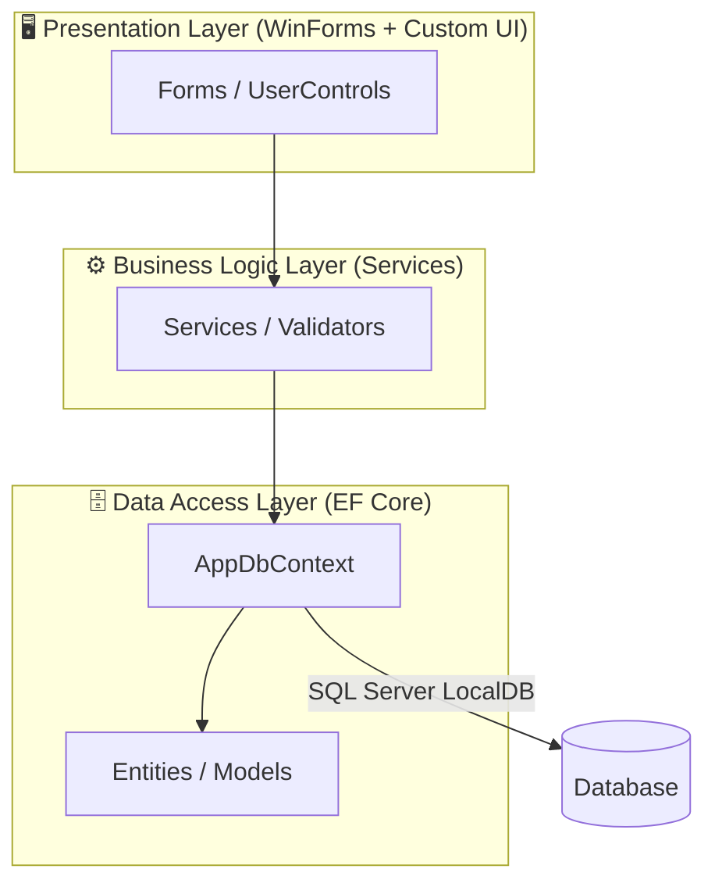
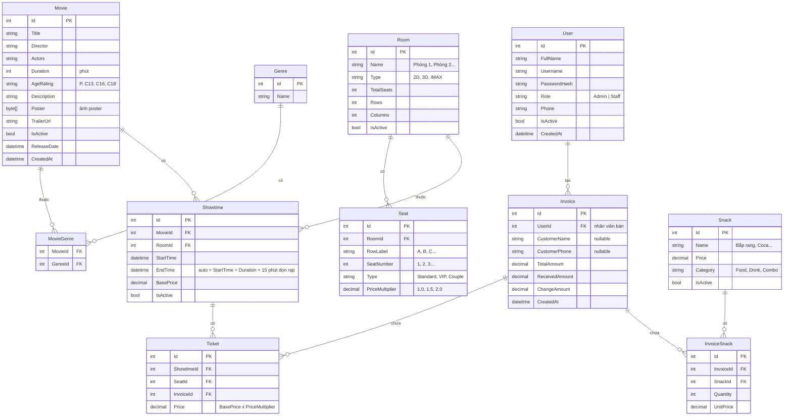
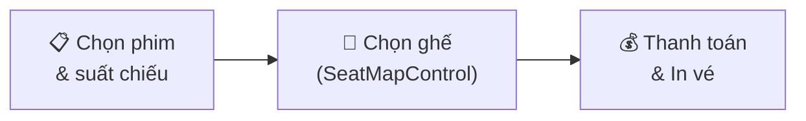

# 🎬 Kế Hoạch Triển Khai: Hệ Thống Quản Lý Lịch Chiếu Phim

> [!NOTE]
> **Dự án:** Bài Tập Lớn .NET — WinForms C# (.NET 10)
> **Ngày tạo:** 03/05/2026 | **Cập nhật:** 03/05/2026 (Phase 4 + UI improvements)

---

## 1. Tổng Quan Kiến Trúc

### 1.1 Kiến trúc 3 lớp (3-Layer Architecture)



### 1.2 Công Nghệ Sử Dụng

| Thành phần | Công nghệ | Trạng thái |
|---|---|---|
| **Framework** | .NET 10, WinForms | ✅ Đã cài |
| **UI Library** | `ReaLTaiizor` (MIT, miễn phí) + Custom GDI+ | ✅ Đã cài |
| **ORM** | EF Core 10 + SQL Server provider | ✅ Đã cài |
| **Database** | SQL Server LocalDB | ✅ Đã tạo DB |
| **Biểu đồ** | `LiveChartsCore.SkiaSharpView.WinForms` | ✅ Đã cài |
| **Xuất PDF** | `QuestPDF` | ✅ Đã cài |
| **Hash mật khẩu** | `BCrypt.Net-Next` | ✅ Đã cài |
| **Sơ đồ ghế** | Custom `SeatMapControl` (GDI+) | 🔲 Phase 3 |

---

## 2. Thiết Kế Cơ Sở Dữ Liệu

### 2.1 Sơ đồ ERD



---

## 3. Cấu Trúc Thư Mục Dự Án

```
BaiTapLon/
├── .gitignore                              ✅
├── BaiTapLon.slnx                          ✅
└── BaiTapLon/
    ├── BaiTapLon.csproj                    ✅
    ├── Program.cs                          ✅ (auto-migrate + seed users)
    ├── appsettings.json                    ✅ (connection string LocalDB)
    │
    ├── Data/
    │   ├── AppDbContext.cs                 ✅ (full config + seed data)
    │   ├── AppDbContextFactory.cs          ✅ (design-time factory)
    │   └── Migrations/                     ✅ (InitialCreate)
    │
    ├── Models/                             ✅ (10 entity classes)
    │   ├── User.cs, Movie.cs, Genre.cs, MovieGenre.cs
    │   ├── Room.cs, Seat.cs, Showtime.cs
    │   ├── Invoice.cs, Ticket.cs
    │   └── Snack.cs, InvoiceSnack.cs
    │
    ├── Services/
    │   ├── AuthService.cs                  ✅
    │   ├── MovieService.cs                 ✅ Phase 2
    │   ├── RoomService.cs                  ✅ Phase 2
    │   ├── ShowtimeService.cs              ✅ Phase 2
    │   ├── TicketService.cs                ✅ Phase 3
    │   ├── InvoiceService.cs               ✅ Phase 3 + Phase 5 (Tickets + InvoiceSnacks transaction)
    │   ├── SnackService.cs                 ✅ Phase 5
    │   └── ReportService.cs                ✅ Phase 4
    │
    ├── Forms/
    │   ├── FrmLogin.cs                     ✅ (dark theme, borderless)
    │   ├── FrmMain.cs                      ✅ (sidebar + header + all modules)
    │   ├── Admin/
    │   │   ├── UcMovieManagement.cs        ✅ Phase 2
    │   │   ├── DlgMovieEdit.cs             ✅ Phase 2
    │   │   ├── UcRoomManagement.cs         ✅ Phase 2
    │   │   ├── DlgRoomEdit.cs              ✅ Phase 2 + Phase 5.5
    │   │   ├── DlgSeatBuilder.cs           ✅ Phase 5.5 (custom seat map grid)
    │   │   ├── UcShowtimeManagement.cs     ✅ Phase 2
    │   │   ├── DlgShowtimeEdit.cs          ✅ Phase 2
    │   │   ├── UcStaffManagement.cs        ✅ Phase 2
    │   │   ├── DlgStaffEdit.cs             ✅ Phase 2
    │   │   ├── UcSnackManagement.cs        ✅ Phase 5
    │   │   ├── DlgSnackEdit.cs             ✅ Phase 5
    │   │   └── UcDashboard.cs              ✅ Phase 4 (LiveCharts2 + PDF export)
    │   ├── Staff/
    │   │   ├── UcNowShowing.cs             ✅ Phase 3
    │   │   ├── UcSeatSelection.cs          ✅ Phase 3 + Phase 5 navigation
    │   │   ├── UcSnackOrder.cs             ✅ Phase 5
    │   │   └── SaleOrderState.cs           ✅ Phase 5
    │   └── Controls/
    │       └── SeatMapControl.cs           ✅ Phase 3 (Custom GDI+ seat map)
    │
    ├── Helpers/
    │   ├── AppConfig.cs                    ✅
    │   ├── SessionManager.cs               ✅
    │   └── PrintHelper.cs                  ✅ Phase 4 (QuestPDF)
    │
    └── Resources/                          ✅ Phase 5.5 (Posters/Snacks assets)
```

---

## 4. Chi Tiết Chức Năng Theo Role

### 4.1 Màn hình Đăng nhập (`FrmLogin`) ✅

- Dark theme với `FormBorderStyle.None`, custom close button, draggable
- Nhập Username + Password → xác thực bằng BCrypt (async)
- Phân quyền: chuyển đến giao diện Admin hoặc Staff
- Hiển thị thông báo lỗi khi sai tài khoản
- Hint mặc định: admin/admin123, staff/staff123

### 4.2 Màn hình chính (`FrmMain`) ✅

- Layout: Custom title bar + Sidebar (250px) + Header (55px) + Content panel
- Sidebar: logo, role label, menu theo quyền, nút đăng xuất ở cuối
- Menu highlight khi active (màu tím), hover effect
- Window controls: minimize, maximize, close
- Content panel swap UserControl (placeholder cho Phase 2+)

### 4.3 Admin — Quản lý Phim (`UcMovieManagement`) 🔲

| Thao tác | Mô tả |
|---|---|
| Xem danh sách | DataGridView + tìm kiếm + lọc thể loại |
| Thêm phim | Dialog: tên, đạo diễn, diễn viên, thời lượng, thể loại (CheckedListBox), poster |
| Sửa phim | Load dữ liệu vào dialog |
| Xóa phim | Soft-delete (`IsActive = false`) |

### 4.4 Admin — Quản lý Phòng chiếu (`UcRoomManagement`) 🔲

| Thao tác | Mô tả |
|---|---|
| Xem danh sách | Tên, loại, số ghế, trạng thái |
| Thêm/Sửa phòng | Tên, loại (2D/3D/IMAX), hàng × cột |
| Thiết lập ghế | Auto-generate + đánh dấu VIP/Couple |

### 4.5 Admin — Quản lý Lịch chiếu (`UcShowtimeManagement`) ⭐ 🔲

> [!IMPORTANT]
> **Logic chống trùng lịch** là tính năng quan trọng nhất:
> ```csharp
> bool isConflict = context.Showtimes.Any(s =>
>     s.RoomId == roomId &&
>     s.Id != currentId &&
>     newStartTime < s.EndTime &&
>     newEndTime > s.StartTime);
> ```

### 4.6 Admin — Quản lý Nhân viên (`UcStaffManagement`) 🔲

- CRUD tài khoản, hash password bằng BCrypt
- Reset mật khẩu, vô hiệu hóa tài khoản

### 4.7 Admin — Thống kê (`UcDashboard`) 🔲

- Doanh thu theo ngày/tháng (Column Chart)
- Top 5 phim (Bar Chart)
- Tỷ lệ lấp đầy (Pie Chart)
- LiveCharts2 + xuất PDF bằng QuestPDF

### 4.8 Staff — Luồng bán vé 🔲



---

## 5. NuGet Packages ✅

```powershell
# Tất cả đã được cài đặt
ReaLTaiizor                                  # UI (MIT, miễn phí)
Microsoft.EntityFrameworkCore                 # ORM
Microsoft.EntityFrameworkCore.SqlServer       # SQL Server provider
Microsoft.EntityFrameworkCore.Tools           # CLI migrations
Microsoft.EntityFrameworkCore.Design          # Design-time factory
LiveChartsCore.SkiaSharpView.WinForms        # Biểu đồ
QuestPDF                                      # Xuất PDF
BCrypt.Net-Next                               # Hash password
Microsoft.Extensions.Configuration            # Config
Microsoft.Extensions.Configuration.Json       # appsettings.json
```

---

## 6. Lộ Trình Phát Triển

### Phase 1: Nền tảng ✅ HOÀN THÀNH (03/05/2026)

- [x] Tạo project WinForms .NET 10
- [x] Tạo `.gitignore`
- [x] Cài đặt 10 NuGet packages
- [x] Tạo 10 Models (User, Movie, Genre, MovieGenre, Room, Seat, Showtime, Invoice, Ticket, Snack, InvoiceSnack)
- [x] Tạo `AppDbContext` (full config: relationships, precision, constraints, seed data)
- [x] Tạo `AppDbContextFactory` (design-time factory cho EF CLI)
- [x] Cấu hình `appsettings.json` (LocalDB connection string)
- [x] Chạy `InitialCreate` migration + apply database
- [x] Seed dữ liệu: 8 genres, 3 phòng chiếu, 240 ghế, 7 đồ ăn
- [x] Seed users tại runtime (admin + staff, BCrypt hash)
- [x] Tạo `AppConfig` helper (đọc connection string)
- [x] Tạo `SessionManager` (quản lý phiên đăng nhập)
- [x] Tạo `AuthService` (login async + create user)
- [x] Tạo `FrmLogin` (dark theme, borderless, draggable, error handling)
- [x] Tạo `FrmMain` (sidebar, header, content panel, role-based menu)
- [x] Build + chạy thành công

### Phase 2: Module Admin CRUD ✅ HOÀN THÀNH (03/05/2026)

**2.1 — MovieService + UcMovieManagement** ✅
- [x] Tạo `MovieService.cs` (GetAll, GetById, Create, Update, SoftDelete, Search, GetAllGenres)
  - [x] Trường `Code` (mã phim) — validate duy nhất, tìm kiếm theo mã
- [x] Tạo `UcMovieManagement.cs` (UserControl)
  - [x] DataGridView hiển thị: Mã phim, Tên, Đạo diễn, Thời lượng, Thể loại...
  - [x] Thanh tìm kiếm (theo mã, tên, đạo diễn) + ComboBox lọc thể loại
  - [x] Nút Thêm/Sửa/Xóa + Refresh, chống re-entrancy
  - [x] `DlgMovieEdit.cs` — 2 cột: fields trái + poster/thể loại phải
  - [x] Upload + hiển thị poster (PictureBox)
- [x] Tích hợp vào `FrmMain.LoadModule("Movies")`

**2.2 — RoomService + UcRoomManagement** ✅
- [x] Tạo `RoomService.cs` (CRUD phòng + generate ghế theo RowConfig)
- [x] Tạo `UcRoomManagement.cs`
  - [x] DataGridView danh sách phòng
  - [x] `DlgRoomEdit.cs` — Cấu hình ghế theo từng hàng (DataGridView)
    - [x] Mỗi hàng: Label (A-Z), Số ghế (variable), Loại (Standard/VIP/Couple), Hệ số giá
    - [x] Nút Thêm hàng / Xóa hàng + tổng kết realtime
    - [x] Hỗ trợ số ghế khác nhau mỗi hàng (VD: hàng A=10, hàng B=12)
  - [x] `DlgSeatBuilder.cs` — Seat Map Builder dạng lưới cho phòng có lối đi/khoảng trống/ghế đôi
    - [x] Lưu tọa độ `GridRow`, `GridColumn`, `GridSpan` cho từng ghế
    - [x] Toolbar chọn `Standard`, `VIP`, `Couple`, `Xóa/Lối đi`
    - [x] Auto-label khi lưu: quét trái sang phải, bỏ ô trống, sinh mã ghế A1, A2...
    - [x] Tương thích chế độ nhanh `RowConfig` cũ

**2.3 — ShowtimeService + UcShowtimeManagement ⭐** ✅
- [x] Tạo `ShowtimeService.cs`
  - [x] CRUD lịch chiếu
  - [x] **Logic chống trùng lịch** (overlap detection) — trả về showtime bị trùng
  - [x] Auto-calculate EndTime = StartTime + Duration + 15 phút dọn rạp
  - [x] Validation: không xóa lịch đã bán vé
- [x] Tạo `UcShowtimeManagement.cs`
  - [x] DataGridView + lọc theo ngày/phim/phòng (3 bộ lọc)
  - [x] `DlgShowtimeEdit.cs` — Dialog thêm lịch chiếu (ComboBox phim, ComboBox phòng, DateTimePicker ngày + giờ, giá vé)
  - [x] Hiển thị cảnh báo nếu trùng lịch (message box chi tiết)

**2.4 — UcStaffManagement** ✅
- [x] Tạo `UcStaffManagement.cs`
  - [x] DataGridView danh sách nhân viên
  - [x] `DlgStaffEdit.cs` — Dialog thêm nhân viên (tên, username, password, phone, role)
  - [x] Toggle active/inactive (không cho khóa bản thân)
  - [x] Reset mật khẩu (tự động đặt thành {username}123)

### Phase 3: Module Bán Vé — Core ✅ HOÀN THÀNH (03/05/2026)

**3.1 — TicketService + InvoiceService** ✅
- [x] Tạo `TicketService.cs` (GetSoldSeatIds, CountSold)
- [x] Tạo `InvoiceService.cs` (CreateAsync — transaction + double-check ghế đã bán)

**3.2 — UcNowShowing** ✅
- [x] Hiển thị phim đang chiếu dạng Card (poster + tên + thời lượng + thể loại)
- [x] Click phim → hiển thị suất chiếu trong ngày (panel phải)
- [x] Suất chiếu button: giờ, phòng, ghế còn/tổng, giá
- [x] Chọn suất → event `ShowtimeSelected` → chuyển sang chọn ghế

**3.3 — SeatMapControl (Custom GDI+)** ✅
- [x] Tạo `SeatMapControl : Control` — double buffered, anti-aliased
- [x] Vẽ ghế bằng GDI+ (OnPaint) — rounded rectangles
- [x] Màu sắc: Trống/Đang chọn/Đã bán/VIP/Couple (5 màu)
- [x] Click chọn/bỏ chọn ghế
- [x] Hover tooltip (tên ghế + loại + giá)
- [x] Event `SeatSelectionChanged`
- [x] Vẽ "MÀN HÌNH" gradient ở trên cùng + legend ở dưới
- [x] Row labels (A, B, C...) bên trái, auto-center

**3.4 — UcSeatSelection (Seat Map + Checkout)** ✅
- [x] Bên trái: SeatMapControl (scrollable, auto-center)
- [x] Bên phải: thông tin phim/suất chiếu + ghế đã chọn + tổng tiền realtime
- [x] Thông tin khách hàng (tên, SĐT — optional)
- [x] Thanh toán: nhập tiền nhận, tính tiền thối
- [x] Validation đầy đủ + dialog xác nhận chi tiết
- [x] Lưu Invoice + Tickets vào DB (transaction)
- [x] Nút Quay lại + event `BackRequested`
- [x] Event `CheckoutCompleted` → quay lại NowShowing

**3.5 — Tích hợp FrmMain** ✅
- [x] `LoadModule("NowShowing")` và `LoadModule("SellTicket")` → UcNowShowing
- [x] Luồng navigation: NowShowing → SeatSelection → Checkout → NowShowing

### Phase 4: Thống Kê & Báo Cáo ✅ HOÀN THÀNH (03/05/2026)

**4.1 — ReportService** ✅
- [x] `ReportService.cs` (queries tổng hợp)
  - [x] `GetStatsAsync()` — tổng phim, phòng, suất hôm nay, vé, doanh thu, hóa đơn
  - [x] `GetRevenueByDateAsync()` — doanh thu + số vé theo ngày
  - [x] `GetRevenueByMonthAsync()` — doanh thu + số vé theo tháng
  - [x] `GetTopMoviesAsync()` — top N phim theo số vé + doanh thu
  - [x] `GetRoomOccupancyAsync()` — tỷ lệ lấp đầy từng phòng

**4.2 — UcDashboard** ✅
- [x] `UcDashboard.cs` + LiveCharts2
  - [x] 6 stat cards (phim, phòng, suất, vé, doanh thu, hóa đơn) với accent colors
  - [x] Doanh thu theo ngày/tháng (Column Chart — có toggle)
  - [x] Top 5 phim ăn khách (Row/Bar Chart)
  - [x] Tỷ lệ lấp đầy phòng (Pie Chart)
  - [x] Bộ lọc ngày (từ/đến) + nút làm mới
- [x] Tích hợp vào `FrmMain.LoadModule("Dashboard")`

**4.3 — Xuất PDF** ✅
- [x] `PrintHelper.cs` (QuestPDF)
  - [x] Header: logo + khoảng thời gian + ngày xuất
  - [x] Tổng quan stats (6 chỉ số)
  - [x] Top 5 phim (định dạng bảng)
  - [x] Doanh thu theo ngày (định dạng bảng + tổng cộng)
  - [x] Footer với số trang

### Phase 4.5: UI/Layout & Admin Polish ✅ HOÀN THÀNH (03/05/2026)

- [x] Tách layout dùng chung cho Admin theo mindset component giống React:
  - [x] `Forms/Admin/Shared/AdminTheme.cs` — design tokens: màu, font, trạng thái nút/grid
  - [x] `Forms/Admin/Shared/AdminControls.cs` — factory cho toolbar, button, input, combobox, date picker, DataGridView
  - [x] `Forms/Admin/Shared/AdminLayouts.cs` — page layout title + toolbar + content fill
- [x] Refactor các màn quản lý dùng shared layout:
  - [x] `UcMovieManagement`
  - [x] `UcRoomManagement`
  - [x] `UcShowtimeManagement`
  - [x] `UcStaffManagement`
- [x] Fix lỗi layout chồng chéo bằng `TableLayoutPanel`, `FlowLayoutPanel`, `Dock=Fill`, toolbar có wrap.
- [x] Thêm `Forms/Controls/SeatLayoutPreviewControl.cs` — preview sơ đồ ghế read-only kiểu rạp phim:
  - [x] Vẽ màn hình, hàng ghế, nhãn hàng trái/phải, số ghế thực tế
  - [x] Hiển thị mã ghế đầy đủ trong ô (`H4`, `J9`) và đọc tọa độ grid custom
  - [x] Màu phân biệt ghế thường, VIP, ghế đôi
  - [x] Preview live trong `DlgRoomEdit` khi cấu hình hàng ghế
  - [x] Preview bên phải trong `UcRoomManagement` khi chọn phòng
- [x] Hoàn thiện quản lý lịch chiếu:
  - [x] Thêm nút Sửa lịch chiếu + double-click để sửa
  - [x] `DlgShowtimeEdit` hỗ trợ cả thêm mới và sửa
  - [x] Sau khi thêm/sửa lịch chiếu, tự chuyển filter sang ngày của lịch vừa lưu và reload danh sách
  - [x] `ShowtimeService.GetByIdAsync()` để load lịch chiếu đang sửa
- [x] Polish Staff bán vé:
  - [x] `UcNowShowing` có bộ chọn ngày chiếu, không còn chỉ khóa cứng vào hôm nay
  - [x] Staff thấy các suất theo ngày được chọn; suất đã bắt đầu vẫn hiện để kiểm tra nhưng bị disable bán vé
  - [x] Dialog thêm lịch mặc định giờ chiếu là mốc sắp tới thay vì luôn 09:00
- [x] Fix sidebar branding: tăng vùng logo/app name để chữ `CineManager` không bị cắt/đè.
- [x] Build kiểm tra thành công ra `C:\tmp\BaiTapLonBuild` vì app đang chạy khóa output `bin`.

### Phase 5: Module Bắp Nước ✅ HOÀN THÀNH (03/05/2026)

**5.1 — SnackService + Admin CRUD** ✅
- [x] `SnackService.cs`
  - [x] `GetAllActiveAsync()`, `GetAllAsync()`, `GetByCategoryAsync()`, `SearchAsync()`
  - [x] `CreateAsync()`, `UpdateAsync()`, `SoftDeleteAsync()`
  - [x] Validate tên món, giá, phân loại (`Food`, `Drink`, `Combo`)
- [x] `UcSnackManagement.cs`
  - [x] DataGridView danh sách món: loại, tên, giá, trạng thái
  - [x] Tìm kiếm theo tên + lọc theo loại
  - [x] Thêm/Sửa/Ẩn món, double-click để sửa
- [x] `DlgSnackEdit.cs`
  - [x] Layout nhập liệu bằng `TableLayoutPanel`
  - [x] `ErrorProvider` cho lỗi tên món/giá thay vì chỉ phụ thuộc MessageBox

**5.2 — Staff POS Bắp Nước** ✅
- [x] `SaleOrderState.cs` giữ state bán hàng giữa màn ghế và màn bắp nước
- [x] `UcSnackOrder.cs`
  - [x] Menu sản phẩm dạng card trong `FlowLayoutPanel`
  - [x] Lọc nhanh theo `Food`, `Drink`, `Combo`
  - [x] Giỏ hàng DataGridView có nút `+` / `-`
  - [x] Tính realtime: tiền vé, tiền bắp nước, tổng bill, tiền thối

**5.3 — Tích hợp Checkout** ✅
- [x] Đổi luồng bán vé: Chọn phim → Chọn ghế → Chọn bắp nước → Thanh toán
- [x] `FrmMain` điều hướng `UcSeatSelection` → `UcSnackOrder`
- [x] `InvoiceService.CreateAsync()` nhận thêm `List<InvoiceSnack>`
- [x] Transaction lưu `Invoice` → `Tickets` → `InvoiceSnacks` → `Commit`
- [x] Giữ double-check race condition ghế đã bán trước khi commit
- [x] Build kiểm tra thành công ra `C:\tmp\BaiTapLonPhase5Build2`

### Phase 5.5: Refactor Phase 1-5 & UI/UX Polish 🔄 ĐANG THỰC HIỆN (04/05/2026)

- [x] Chuẩn hóa layout quản trị bằng `Dock`, `FlowLayoutPanel`, `TableLayoutPanel`:
  - [x] `UcMovieManagement`
  - [x] `UcRoomManagement`
  - [x] `UcStaffManagement`
  - [x] `AdminLayouts.CreateManagementPage()` dùng `pnlHeader Dock=Top`, content/grid `Dock=Fill`, header `BringToFront`
- [x] Chuẩn hóa `ErrorProvider` cho các dialog quản trị còn lại:
  - [x] `DlgMovieEdit`
  - [x] `DlgRoomEdit`
  - [x] `DlgShowtimeEdit`
  - [x] `DlgStaffEdit`
- [x] Cải thiện lưu poster phim:
  - [x] Copy file upload vào `Resources/Posters`
  - [x] DB lưu tên file/relative path (`PosterPath`) thay vì phụ thuộc đường dẫn tuyệt đối trên máy dev
  - [x] Load ảnh bằng `Path.Combine(Application.StartupPath, "Resources", "Posters", fileName)`, fallback sang `Poster` byte[] cũ nếu cần
- [ ] Hoàn thiện hóa đơn/PDF bán hàng:
  - [ ] Thêm hàm xuất hóa đơn bán vé có bảng "Dịch vụ đi kèm"
  - [ ] In danh sách bắp nước theo tên món, số lượng, đơn giá, thành tiền
- [ ] Polish dashboard:
  - [x] Đảm bảo các query thống kê chạy bằng `async/await`
  - [x] Thêm trạng thái loading trong lúc chờ dữ liệu/biểu đồ
- [x] Chống race condition bán ghế trong `InvoiceService.CreateAsync()`:
  - [x] Double-check ghế đã bán trong transaction trước khi lưu invoice/tickets/snacks
  - [x] Thêm unique index `(ShowtimeId, SeatId)` và transaction `Serializable` để chặn commit trùng khi 2 máy bán cùng ghế sát thời điểm
- [x] Seat Map Builder thực tế cho phòng chiếu không đều:
  - [x] `Seat` có `GridRow`, `GridColumn`, `GridSpan`
  - [x] Migration `AddSeatGridCoordinates`
  - [x] `SeatMapControl` render/hit-test theo tọa độ grid thay vì ma trận đều
  - [x] `DlgRoomEdit` mở builder từ cấu hình hàng hiện tại và lưu custom layout
  - [x] `RoomService.CreateAsync()` hỗ trợ tạo ghế từ custom layout hoặc `RowConfig`

### Phase 6: Hoàn Thiện & Polish

- [ ] Test toàn bộ luồng: Admin CRUD → Staff bán vé → Thống kê
- [ ] Fix bug, xử lý edge cases
- [ ] Seed dữ liệu demo đẹp (phim thật, poster)
- [ ] Tài liệu hướng dẫn sử dụng

> **Tổng ước tính: ~19-25 ngày** (thong thả)

---

## 7. Quyết Định Đã Xác Nhận

| # | Câu hỏi | Quyết định |
|---|---|---|
| 1 | Database | **SQL Server LocalDB** (đi kèm VS) |
| 2 | UI Library | **ReaLTaiizor** (MIT) + Custom `Form` (borderless, GDI+) |
| 3 | Bắp nước | Có, đưa vào **Phase 5** |
| 4 | Xuất báo cáo | **PDF** trước (QuestPDF) |
| 5 | Deadline | Thong thả |
| 6 | .env | Không cần — dùng `appsettings.json` (LocalDB không password) |
| 7 | Sơ đồ ghế | **Custom GDI+ Control** (hiệu suất cao, 1 control thay vì 200 Button) |

---

## 8. Ghi Chú Kỹ Thuật

- **BCrypt trong seed data**: Không dùng `HasData()` vì hash thay đổi mỗi lần build → seed users tại runtime trong `Program.cs`
- **EF Core Design**: Cần `AppDbContextFactory` + package `Microsoft.EntityFrameworkCore.Design` cho `dotnet ef` CLI
- **FormBorderStyle.None**: Tự vẽ title bar, window buttons, và xử lý drag-to-move
- **dotnet-ef tool**: Phải cài đúng version `10.0.7` khớp với EF Core packages

