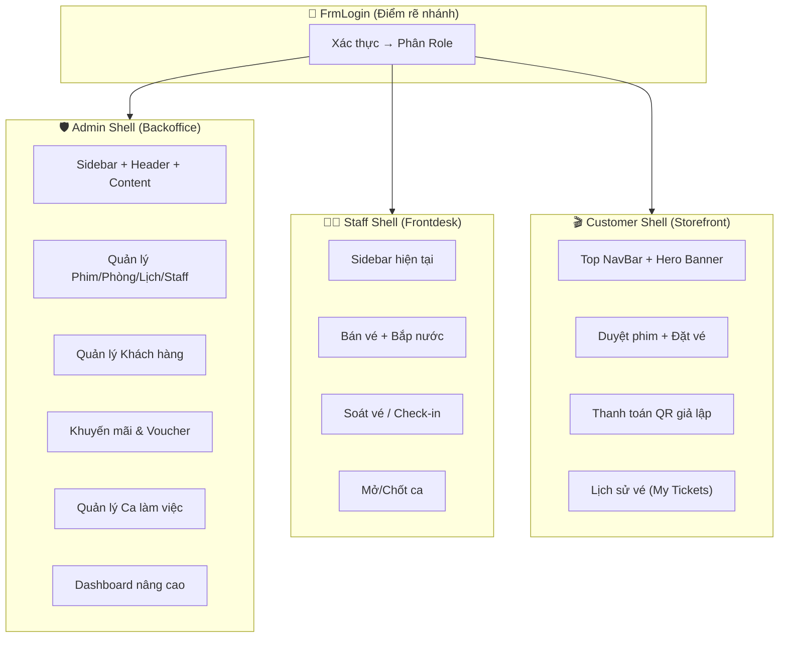
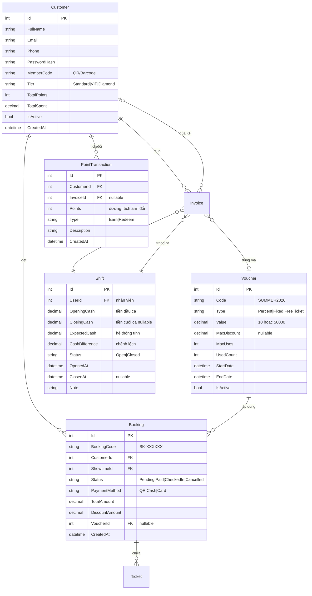
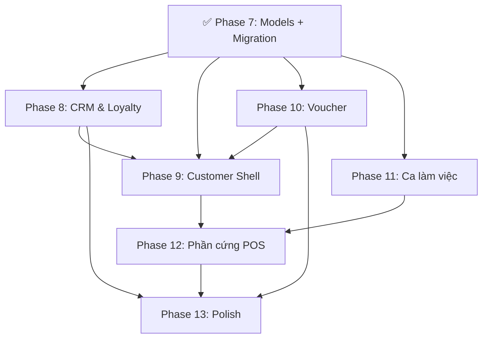

# 🚀 Kế Hoạch Nâng Cấp CineManager — Commercial Grade

> [!NOTE]
> **Dự án:** CineManager — WinForms C# (.NET 10)
> **Ngày tạo:** 04/05/2026 | **Cập nhật:** 04/05/2026 (Phase 7 ✅)
> **Phạm vi:** Phase 7 → Phase 13
> **Tiền đề:** Phase 1-5.5 đã hoàn thành (CRUD, Bán vé, Bắp nước, Thống kê, Seat Map GDI+)

---

## Tổng Quan Kiến Trúc Mới



---

## Thiết Kế CSDL Bổ Sung



---

## Cấu Trúc Thư Mục Bổ Sung

```
BaiTapLon/
├── Models/                          (Bổ sung)
│   ├── Customer.cs                  ✅ Phase 7
│   ├── Booking.cs                   ✅ Phase 7
│   ├── PointTransaction.cs          ✅ Phase 7
│   ├── Voucher.cs                   ✅ Phase 7
│   └── Shift.cs                     ✅ Phase 7
│
├── Services/                        (Bổ sung)
│   ├── CustomerService.cs           ✅ Phase 7
│   ├── BookingService.cs            Phase 9
│   ├── PointService.cs              Phase 8
│   ├── VoucherService.cs            Phase 10
│   ├── ShiftService.cs              Phase 11
│   └── HardwareService.cs           Phase 12
│
├── Forms/
│   ├── FrmLogin.cs                  (Sửa: thêm nút Đăng ký KH — Phase 9)
│   ├── FrmMain.cs                   (Sửa: routing theo Role — Phase 9)
│   ├── FrmCustomerMain.cs           Phase 9 ← Shell mới cho Customer
│   ├── Admin/
│   │   ├── UcCustomerManagement.cs  Phase 8
│   │   ├── UcVoucherManagement.cs   Phase 10
│   │   ├── DlgVoucherEdit.cs        Phase 10
│   │   └── UcShiftReport.cs         Phase 11
│   ├── Staff/
│   │   ├── UcCheckIn.cs             Phase 9
│   │   ├── UcShiftPanel.cs          Phase 11
│   │   └── (UcSeatSelection sửa: thêm Mode)
│   └── Customer/                    Phase 9 ← Folder mới
│       ├── UcStorefront.cs          (Trang chủ: banner + grid phim)
│       ├── UcMovieDetail.cs         (Chi tiết phim + trailer)
│       ├── UcCustomerBooking.cs     (Luồng đặt vé self-service)
│       ├── UcPaymentGateway.cs      (QR giả lập + timer)
│       ├── UcMyTickets.cs           (Lịch sử vé + mã QR)
│       └── UcMyProfile.cs           (Thông tin + điểm + hạng)
│
├── Helpers/
│   ├── BarcodeHelper.cs             Phase 8 (sinh mã QR/Barcode — QRCoder)
│   └── HardwareHelper.cs            Phase 12 (giả lập ESC/POS)
```

---

## Thứ Tự Phụ Thuộc



---

## Phase 7: Models & Migration ✅ HOÀN THÀNH (04/05/2026)

> [!IMPORTANT]
> Phase nền tảng — tất cả các phase sau đều phụ thuộc vào các entity ở đây.

**7.1 — Tạo 5 Models mới** ✅
- [x] `Customer.cs` (FullName, Email, Phone, PasswordHash, MemberCode, Tier, TotalPoints, TotalSpent)
- [x] `Booking.cs` (BookingCode, CustomerId, ShowtimeId, Status, PaymentMethod, TotalAmount, DiscountAmount, VoucherId)
- [x] `PointTransaction.cs` (CustomerId, InvoiceId, Points[+/-], Type[Earn/Redeem], Description)
- [x] `Voucher.cs` (Code, Type[Percent/Fixed/FreeTicket], Value, MaxDiscount, MaxUses, UsedCount, StartDate, EndDate)
- [x] `Shift.cs` (UserId, OpeningCash, ClosingCash, ExpectedCash, CashDifference, Status[Open/Closed], Note)

**7.2 — Cập nhật Models cũ** ✅
- [x] `Invoice.cs`: +`CustomerId` (FK nullable), +`ShiftId` (FK nullable), +`VoucherId` (FK nullable), +`PaymentMethod`, +`DiscountAmount`
- [x] `Ticket.cs`: +`BookingId` (FK nullable) — liên kết vé với booking online

**7.3 — Cập nhật AppDbContext** ✅
- [x] 5 DbSet mới: Customers, Vouchers, Bookings, PointTransactions, Shifts
- [x] Config relationships, precision, indexes (Email unique, MemberCode unique, Voucher.Code unique, BookingCode unique)
- [x] Migration `AddCrmShiftVoucherBooking` — tạo và apply thành công

**7.4 — CustomerService** ✅
- [x] `RegisterAsync()` — hash password BCrypt, sinh MemberCode `CM-XXXXXX`
- [x] `LoginAsync()` — xác thực bằng email + BCrypt
- [x] `GetByPhoneAsync()`, `GetByMemberCodeAsync()` — Staff quét mã / nhập SĐT
- [x] `SearchAsync()` — tìm theo tên/SĐT/email/mã thành viên
- [x] `GetByTierAsync()` — lọc theo hạng
- [x] `UpdateTierAsync()` — tự động phân hạng (Standard < 2M < VIP < 10M < Diamond)
- [x] `AddSpendingAsync()` — cộng dồn chi tiêu + auto nâng hạng
- [x] `UpdateProfileAsync()`, `ChangePasswordAsync()`, `ToggleActiveAsync()`

**7.5 — SessionManager nâng cấp** ✅
- [x] `LoginAsCustomer(Customer)` + `CurrentCustomer` + `IsCustomerLoggedIn`
- [x] Đảm bảo chỉ 1 phiên (User hoặc Customer) tại một thời điểm

**7.6 — NuGet** ✅
- [x] Cài `QRCoder 1.6.0` (MIT, nhẹ — dùng cho thẻ thành viên, mã vé, voucher)

---

## Phase 8: CRM & Loyalty + Admin UI ✅ HOÀN THÀNH (04/05/2026)

**8.1 — PointService** ✅
- [x] `EarnPointsAsync(customerId, invoiceId, amount)` — tích điểm theo hạng (Standard: 1%, VIP: 1.5%, Diamond: 2%)
- [x] `RedeemPointsAsync(customerId, points)` — đổi điểm (1000 điểm = 10,000đ, bội số 100)
- [x] `GetHistoryAsync(customerId)` — lịch sử tích/đổi
- [x] `GetBalanceAsync(customerId)` — điểm hiện tại
- [x] `GetSummaryAsync(customerId)` — tổng hợp: đã tích / đã đổi / còn lại

**8.2 — BarcodeHelper** ✅
- [x] `GenerateQrCode(content)` — sinh QR dạng Bitmap bằng `QRCoder` (PngByteQRCode)
- [x] `GenerateQrCode(content, width, height)` — QR kích thước cố định
- [x] `GenerateBookingCode()` — sinh mã BK-XXXXXX

**8.3 — Admin: UcCustomerManagement** ✅
- [x] DataGridView: Mã TV, Tên, SĐT, Email, Hạng (icon), Điểm, Tổng chi, Trạng thái, Ngày ĐK
- [x] Tìm kiếm (tên/SĐT/email/mã TV) + lọc theo hạng (Standard/VIP/Diamond)
- [x] Split layout: grid trái + detail phải (QR code, thông tin, thống kê, lịch sử điểm)
- [x] Hiển thị progress bar đến hạng tiếp theo
- [x] Nút Khóa/Mở tài khoản
- [x] Tích hợp vào `FrmMain` sidebar: "👤 Khách hàng" → `LoadModule("Customers")`

**8.4 — Staff: Bán hàng có định danh KH** ✅
- [x] `UcSeatSelection`: ô SĐT/Mã TV + nút 🔍 tra cứu + Enter để lookup
- [x] Auto-lookup: tìm theo MemberCode trước, rồi theo SĐT → hiển thị tên + hạng + điểm
- [x] `SaleOrderState` thêm `CustomerId` truyền qua checkout flow
- [x] `UcSnackOrder` checkout: Invoice lưu `CustomerId`, tự động gọi `PointService.EarnPointsAsync()`
- [x] `CustomerService.AddSpendingAsync()` cập nhật TotalSpent + auto nâng hạng
- [x] Thông báo checkout hiển thị "🎁 Tích được X điểm thưởng!"
- [ ] Khi nhập → auto-lookup `CustomerService.GetByPhoneAsync()` → hiển thị tên + hạng + điểm
- [ ] Sau checkout: tự động gọi `PointService.EarnPointsAsync()`
- [ ] Invoice lưu `CustomerId` thay vì chỉ CustomerName/Phone dạng string

---

## Phase 9: Customer Shell — Giao diện Khách Hàng (3-4 ngày)

> [!IMPORTANT]
> Phase lớn nhất — tạo trải nghiệm hoàn toàn mới cho Customer role.

**9.1 — Tái cấu trúc FrmLogin**
- [ ] Thêm nút "Chưa có tài khoản? Đăng ký ngay" → mở `DlgCustomerRegister`
- [ ] `DlgCustomerRegister`: form đăng ký (Họ tên, Email, SĐT, Mật khẩu, Xác nhận MK)
- [ ] Sau đăng nhập: kiểm tra Role — nếu User → `FrmMain`, nếu Customer → `FrmCustomerMain`

**9.2 — FrmCustomerMain (Customer Shell)**
- [ ] `FormBorderStyle.None`, dark theme, draggable (giống FrmMain)
- [ ] **Top NavBar**: Logo | Trang chủ | Phim Đang Chiếu | Lịch Sử Vé | [Avatar + Tên KH ▼]
- [ ] Dropdown avatar: Hồ sơ, Điểm thưởng, Đăng xuất
- [ ] Content panel `Dock=Fill` swap UserControl theo menu

**9.3 — UcStorefront (Trang chủ KH)**
- [ ] Hero Banner: slider poster phim nổi bật (auto-rotate 5s, manual arrows)
- [ ] Section "🔥 Phim Đang Hot": FlowLayoutPanel card phim (poster + tên + rating + thời lượng)
- [ ] Section "📅 Phim Sắp Chiếu": card nhỏ hơn, có nhãn "Coming Soon"
- [ ] Click card → chuyển sang `UcMovieDetail`

**9.4 — UcMovieDetail**
- [ ] Poster lớn bên trái + thông tin bên phải (tên, đạo diễn, diễn viên, thể loại, mô tả, rating tuổi)
- [ ] Nút "▶ Xem Trailer" (mở trình duyệt TrailerUrl)
- [ ] Danh sách suất chiếu theo ngày (tái sử dụng logic `UcNowShowing`)
- [ ] Click suất → chuyển sang `UcCustomerBooking`

**9.5 — UcCustomerBooking (Self-booking Flow)**
- [ ] Tái sử dụng `SeatMapControl` với `Mode = CustomerMode`
- [ ] CustomerMode: ẩn các control nhạy cảm, UI thân thiện hơn (nút lớn, màu sắc bắt mắt)
- [ ] Tái sử dụng `UcSnackOrder` với `Mode = CustomerMode` (ẩn chiết khấu)
- [ ] Bước cuối → chuyển sang `UcPaymentGateway`

**9.6 — UcPaymentGateway (Thanh toán giả lập)**
- [ ] Hiển thị tóm tắt đơn: phim, ghế, bắp nước, tổng tiền, giảm giá (nếu có voucher)
- [ ] Ô nhập mã giảm giá + nút "Áp dụng"
- [ ] Hiển thị QR Code (Momo/VNPay giả lập) — dùng `BarcodeHelper`
- [ ] Timer đếm ngược 10s → tự động "Thanh toán thành công"
- [ ] Tạo `Booking` với status `Paid`, sinh `BookingCode`
- [ ] Animation confetti/checkmark khi thành công

**9.7 — UcMyTickets (Lịch sử vé)**
- [ ] Card list vé: poster nhỏ + tên phim + ngày giờ + ghế + trạng thái (Chưa xem / Đã xem / Hủy)
- [ ] Click vào vé → popup chi tiết + mã QR/Barcode của BookingCode
- [ ] Lọc: Sắp tới / Đã xem / Đã hủy

**9.8 — UcMyProfile**
- [ ] Thông tin cá nhân (sửa tên, SĐT, đổi mật khẩu)
- [ ] Thẻ thành viên: hiển thị MemberCode dạng QR + hạng + điểm hiện tại
- [ ] Progress bar đến hạng tiếp theo (VD: còn 200,000đ nữa để lên VIP)

---

## Phase 10: Khuyến Mãi & Voucher (2 ngày)

**10.1 — VoucherService**
- [ ] `CreateAsync(voucher)` — validate code unique, ngày hết hạn
- [ ] `ValidateAsync(code, orderTotal)` — kiểm tra: hạn sử dụng, số lần dùng, điều kiện tối thiểu
- [ ] `ApplyAsync(code, invoiceId)` — tăng UsedCount, trả về số tiền giảm
- [ ] `GetAllAsync()`, `SearchAsync()`, `DeactivateAsync()`

**10.2 — Tính tiền giảm giá**
- [ ] `Percent`: giảm X% tổng bill, tối đa MaxDiscount
- [ ] `Fixed`: giảm cứng X đồng
- [ ] `FreeTicket`: miễn phí vé rẻ nhất trong order

**10.3 — Admin: UcVoucherManagement**
- [ ] DataGridView: Mã, Loại, Giá trị, Đã dùng/Tối đa, Ngày HH, Trạng thái
- [ ] `DlgVoucherEdit`: tạo/sửa voucher (code, loại, giá trị, max discount, max uses, ngày bắt đầu/kết thúc)
- [ ] Nút: Tạo mới, Sửa, Vô hiệu hóa

**10.4 — Tích hợp vào Checkout**
- [ ] Staff `UcSnackOrder`: thêm ô "Mã giảm giá" + nút Áp dụng → gọi `VoucherService.ValidateAsync()`
- [ ] Customer `UcPaymentGateway`: tương tự
- [ ] Hiển thị dòng "Giảm giá: -XX,XXXđ" trong tóm tắt bill
- [ ] `InvoiceService.CreateAsync()`: lưu VoucherId + DiscountAmount vào Invoice

---

## Phase 11: Ca Làm Việc & Két Tiền (2 ngày)

**11.1 — ShiftService**
- [ ] `OpenShiftAsync(userId, openingCash)` — kiểm tra user chưa có ca đang mở
- [ ] `CloseShiftAsync(shiftId, actualCash, note)` — tính ExpectedCash, CashDifference
- [ ] `GetCurrentShiftAsync(userId)` — lấy ca đang mở
- [ ] `GetShiftReportAsync(shiftId)` — chi tiết: số HĐ, doanh thu theo phương thức thanh toán

**11.2 — Tính ExpectedCash khi chốt ca**
```
ExpectedCash = OpeningCash
    + Σ(Invoice.TotalAmount WHERE PaymentMethod = 'Cash' AND ShiftId = this)
    - Σ(Invoice.ChangeAmount WHERE PaymentMethod = 'Cash' AND ShiftId = this)
CashDifference = ActualCash - ExpectedCash
```

**11.3 — Staff: UcShiftPanel**
- [ ] Khi Staff đăng nhập → kiểm tra ca: nếu chưa mở → bắt buộc mở ca trước khi bán
- [ ] Form mở ca: nhập số tiền đầu ca (tiền thối dự trữ)
- [ ] Trong ca: hiển thị badge "Ca đang mở từ HH:mm"
- [ ] Nút "Chốt ca" → dialog: hệ thống hiển thị ExpectedCash, nhân viên nhập ActualCash → báo Cân bằng/Dư/Thiếu
- [ ] Mọi Invoice tạo trong ca tự động gắn `ShiftId`

**11.4 — Invoice: Phương thức thanh toán**
- [ ] `UcSnackOrder` checkout: thêm radio chọn "Tiền mặt / Thẻ / Chuyển khoản"
- [ ] Lưu `PaymentMethod` vào Invoice
- [ ] Nếu "Thẻ/CK" → không cần nhập tiền nhận/thối

**11.5 — Admin: UcShiftReport**
- [ ] Danh sách ca đã chốt: nhân viên, thời gian, tiền mở/đóng, chênh lệch
- [ ] Lọc theo nhân viên, ngày
- [ ] Click → chi tiết X-Report: số HĐ, tiền mặt/thẻ/CK, tổng

---

## Phase 12: Tích Hợp Phần Cứng POS — Giả Lập (2 ngày)

**12.1 — Barcode/QR Scanner (giả lập)**
- [ ] `HardwareHelper.EnableBarcodeMode(TextBox target)` — bắt sự kiện KeyPress tốc độ cao
- [ ] Khi scanner gõ chuỗi nhanh (< 50ms/ký tự) + Enter → nhận diện là scan, không phải gõ tay
- [ ] Tích hợp vào: ô "Mã thành viên" (Staff), ô "Mã vé" (Check-in), ô "Mã voucher"

**12.2 — Staff: UcCheckIn (Soát vé)**
- [ ] Ô nhập "Mã đặt chỗ" (hỗ trợ scan hoặc gõ tay)
- [ ] Nhập mã → gọi `BookingService.GetByCodeAsync()` → hiển thị: Phim, Giờ, Ghế, Trạng thái
- [ ] Nút "Xác nhận vào rạp" → cập nhật Booking.Status = `CheckedIn`
- [ ] Nút "In vé vật lý" → gọi PrintHelper

**12.3 — Thermal Printing (giả lập)**
- [ ] `HardwareHelper.PrintReceipt(invoiceData)` — giả lập gửi lệnh ESC/POS
- [ ] Template bill: Logo text, tên rạp, thông tin vé, bắp nước, tổng, mã QR, ngày giờ
- [ ] `HardwareHelper.OpenCashDrawer()` — giả lập kick drawer (show MessageBox)
- [ ] Fallback: dùng QuestPDF xuất PDF như cũ

---

## Phase 13: Dashboard Nâng Cao & Polish (1-2 ngày)

**13.1 — Báo cáo mới cho Admin**
- [ ] Biểu đồ: Tỷ lệ mua tại quầy (Staff) vs. mua online (Customer)
- [ ] Biểu đồ: Top khách hàng chi tiêu nhiều nhất
- [ ] Biểu đồ: Tỷ lệ sử dụng voucher + hiệu quả khuyến mãi
- [ ] Thống kê ca: tổng chênh lệch két tiền theo tháng

**13.2 — Seed Data Demo**
- [ ] Tạo 5-10 phim thật (poster, trailer YouTube)
- [ ] Tạo 5 khách hàng demo với lịch sử mua
- [ ] Tạo 3-5 voucher mẫu
- [ ] Dữ liệu lịch chiếu 1 tuần

**13.3 — Polish & Test**
- [ ] Test toàn bộ luồng 3 role: Admin → Staff → Customer
- [ ] Fix edge cases, responsive layout
- [ ] Tài liệu hướng dẫn sử dụng

---

## NuGet Packages Bổ Sung

| Package | Mục đích | Phase | Trạng thái |
|---|---|---|---|
| `QRCoder 1.6.0` | Sinh QR Code (thẻ thành viên, mã vé, voucher) | 7 | ✅ Đã cài |

## Tổng Ước Tính

| Phase | Nội dung | Thời gian | Trạng thái |
|---|---|---|---|
| 7 | Models + Migration + CustomerService | 1-2 ngày | ✅ Hoàn thành |
| 8 | CRM & Loyalty + Admin UI | 2-3 ngày | 🔲 |
| 9 | Customer Shell (Storefront) | 3-4 ngày | 🔲 |
| 10 | Voucher & Khuyến mãi | 2 ngày | 🔲 |
| 11 | Ca làm việc & Két tiền | 2 ngày | 🔲 |
| 12 | Phần cứng POS (giả lập) | 2 ngày | 🔲 |
| 13 | Dashboard + Polish | 1-2 ngày | 🔲 |
| **Tổng** | | **~13-17 ngày** | |

---

## Quyết Định Đã Xác Nhận

| # | Câu hỏi | Quyết định |
|---|---|---|
| 1 | QR Code library | **QRCoder 1.6.0** (MIT, nhẹ, free) |
| 2 | Phần cứng POS | **Giả lập** — không cần máy in nhiệt/scanner thật |
| 3 | Customer Tier | Standard (< 2M) → VIP (2M-10M) → Diamond (> 10M) |
| 4 | Points rate | Standard: 1% / VIP: 1.5% / Diamond: 2% |
| 5 | Points redeem | 1000 điểm = 10,000đ |

---

## Gợi Ý Kỹ Thuật: Component Mode Pattern

```csharp
// UcSeatSelection nhận Mode để phục vụ cả Staff và Customer
public enum SaleMode { StaffMode, CustomerMode }

public class UcSeatSelection : UserControl
{
    public SaleMode Mode { get; set; } = SaleMode.StaffMode;

    private void ApplyMode()
    {
        // CustomerMode: ẩn ô chiết khấu, đổi màu nút, ẩn thông tin nhạy cảm
        pnlDiscount.Visible = Mode == SaleMode.StaffMode;
        btnCheckout.BackColor = Mode == SaleMode.CustomerMode
            ? Color.FromArgb(76, 175, 80)   // Xanh lá thân thiện
            : Color.FromArgb(100, 80, 255); // Tím admin
    }
}
```

```csharp
// FrmLogin routing theo role
if (user != null) // User (Admin/Staff)
{
    SessionManager.Login(user);
    new FrmMain().Show();
}
else if (customer != null) // Customer
{
    SessionManager.LoginAsCustomer(customer);
    new FrmCustomerMain().Show();
}
```
