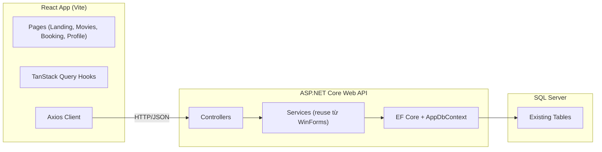
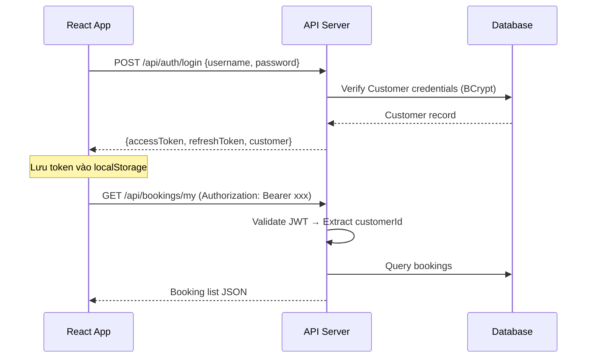

# 🎬 CineManager Web — Implementation Plan

## Tổng quan kiến trúc



> [!IMPORTANT]
> Backend API và Frontend React **dùng chung database SQL Server** hiện tại. Không cần migrate hay tạo DB mới.

---

## Tech Stack

| Layer | Công nghệ | Lý do |
|-------|-----------|-------|
| **Backend** | ASP.NET Core 10 Web API | Dùng chung EF Core + Models với WinForms |
| **Frontend** | React 19 + Vite | Nhanh, modern, SPA |
| **UI Kit** | shadcn/ui + Tailwind CSS 4 | Component chất lượng cao, customizable |
| **State** | TanStack Query v5 | Server-state caching, refetch tự động |
| **HTTP** | Axios | Interceptors, error handling |
| **Validation** | Zod | Type-safe schema validation |
| **Routing** | React Router v7 | Nested routes, loaders |
| **Auth** | JWT (Access + Refresh) | Stateless, phù hợp SPA |
| **Animation** | Framer Motion | Micro-interactions mượt mà |

---

## Phase 1: Backend — ASP.NET Core Web API

### 1.1 Tạo project

```
d:\Study\.Net\BaiTapLon\
├── BaiTapLon/              ← WinForms (giữ nguyên)
├── BaiTapLon.Api/           ← NEW: Web API project
├── BaiTapLon.Shared/        ← NEW: Shared Models + DbContext
└── cinemanager-web/         ← NEW: React frontend
```

**Bước thực hiện:**
1. Tạo project `BaiTapLon.Api` (ASP.NET Core Web API)
2. Tách `Models/` và `Data/AppDbContext.cs` vào project `BaiTapLon.Shared` (Class Library)
3. Cả WinForms lẫn API đều reference `BaiTapLon.Shared`
4. Copy/adapt các Service cần thiết cho API

### 1.2 API Endpoints

#### Auth (`/api/auth`)
| Method | Endpoint | Mô tả |
|--------|----------|-------|
| POST | `/register` | Đăng ký Customer mới |
| POST | `/login` | Đăng nhập → JWT |
| POST | `/refresh` | Refresh token |
| GET | `/me` | Thông tin user hiện tại |

#### Movies (`/api/movies`)
| Method | Endpoint | Mô tả |
|--------|----------|-------|
| GET | `/` | Danh sách phim đang chiếu (có filter genre, search) |
| GET | `/{id}` | Chi tiết phim + rating trung bình |
| GET | `/{id}/showtimes?date=` | Lịch chiếu theo ngày |
| GET | `/{id}/reviews` | Danh sách đánh giá |
| POST | `/{id}/reviews` | 🔒 Gửi đánh giá (auth required) |

#### Booking (`/api/bookings`)
| Method | Endpoint | Mô tả |
|--------|----------|-------|
| GET | `/showtimes/{id}/seats` | Sơ đồ ghế + trạng thái (available/sold) |
| POST | `/` | 🔒 Tạo booking (seatIds, showtimeId, voucherCode?) |
| GET | `/my` | 🔒 Lịch sử booking của tôi |
| GET | `/{code}` | 🔒 Chi tiết booking theo mã |

#### Profile (`/api/profile`)
| Method | Endpoint | Mô tả |
|--------|----------|-------|
| GET | `/` | 🔒 Thông tin hồ sơ + điểm + hạng |
| PUT | `/` | 🔒 Cập nhật tên, email, SĐT |
| GET | `/points` | 🔒 Lịch sử tích điểm |

#### Misc
| Method | Endpoint | Mô tả |
|--------|----------|-------|
| GET | `/api/genres` | Danh sách thể loại |
| GET | `/api/snacks` | Danh sách bắp nước |
| POST | `/api/vouchers/validate` | 🔒 Kiểm tra mã giảm giá |

### 1.3 JWT Auth Flow



---

## Phase 2: Frontend — React App

### 2.1 Khởi tạo project

```bash
cd d:\Study\.Net\BaiTapLon
npx -y create-vite@latest cinemanager-web -- --template react-ts
cd cinemanager-web
npm install
npx -y shadcn@latest init
```

### 2.2 Dependencies

```bash
# Core
npm i axios @tanstack/react-query react-router-dom zod
npm i @hookform/resolvers react-hook-form
npm i framer-motion lucide-react
npm i -D @tanstack/react-query-devtools
```

### 2.3 Cấu trúc thư mục

```
src/
├── api/
│   ├── client.ts           # Axios instance + interceptors
│   ├── auth.api.ts          # login, register, refresh
│   ├── movies.api.ts        # getMovies, getMovieById, getShowtimes
│   ├── bookings.api.ts      # createBooking, getMyBookings
│   └── profile.api.ts       # getProfile, updateProfile
├── components/
│   ├── ui/                  # shadcn components (Button, Card, Dialog...)
│   ├── layout/
│   │   ├── Navbar.tsx
│   │   ├── Footer.tsx
│   │   └── RootLayout.tsx
│   ├── movie/
│   │   ├── MovieCard.tsx
│   │   ├── MovieHero.tsx
│   │   ├── ShowtimePicker.tsx
│   │   └── ReviewSection.tsx
│   ├── booking/
│   │   ├── SeatMap.tsx       # Interactive seat grid
│   │   ├── SeatLegend.tsx
│   │   ├── BookingSummary.tsx
│   │   └── PaymentForm.tsx
│   └── profile/
│       ├── ProfileCard.tsx
│       ├── BookingHistory.tsx
│       └── PointsHistory.tsx
├── hooks/
│   ├── useAuth.ts           # Auth context + JWT management
│   ├── useMovies.ts         # TanStack Query hooks for movies
│   ├── useBookings.ts       # TanStack Query hooks for bookings
│   └── useProfile.ts
├── lib/
│   ├── schemas.ts           # Zod schemas (loginSchema, registerSchema, bookingSchema)
│   ├── utils.ts             # cn(), formatCurrency(), formatDate()
│   └── constants.ts
├── pages/
│   ├── HomePage.tsx          # Landing + Hero + NowShowing grid
│   ├── MoviesPage.tsx        # All movies + filter/search
│   ├── MovieDetailPage.tsx   # Detail + showtimes + reviews
│   ├── BookingPage.tsx       # Seat selection → Summary → Confirm
│   ├── ProfilePage.tsx       # My profile + booking history
│   ├── LoginPage.tsx
│   ├── RegisterPage.tsx
│   └── NotFoundPage.tsx
├── providers/
│   ├── AuthProvider.tsx
│   └── QueryProvider.tsx
├── App.tsx                   # Router setup
└── main.tsx
```

### 2.4 Routing

```tsx
// App.tsx
<Routes>
  <Route element={<RootLayout />}>
    <Route index element={<HomePage />} />
    <Route path="movies" element={<MoviesPage />} />
    <Route path="movies/:id" element={<MovieDetailPage />} />
    <Route path="login" element={<LoginPage />} />
    <Route path="register" element={<RegisterPage />} />
    {/* Protected routes */}
    <Route element={<ProtectedRoute />}>
      <Route path="booking/:showtimeId" element={<BookingPage />} />
      <Route path="profile" element={<ProfilePage />} />
    </Route>
    <Route path="*" element={<NotFoundPage />} />
  </Route>
</Routes>
```

---

## Phase 3: Thiết kế UI — Tham khảo CGV/Galaxy/Lotte

### 3.1 Trang chủ (HomePage)

```
┌─────────────────────────────────────────────┐
│  Navbar:  Logo  |  Phim  |  Lịch chiếu  |  │
│           [Đăng nhập]  [Đăng ký]            │
├─────────────────────────────────────────────┤
│                                             │
│   ██████ HERO BANNER (phim nổi bật) ██████  │
│   Poster lớn + Tên phim + Trailer button    │
│   [🎬 Đặt vé ngay]                         │
│                                             │
├─────────────────────────────────────────────┤
│  🔥 Phim đang chiếu                        │
│  ┌─────┐ ┌─────┐ ┌─────┐ ┌─────┐           │
│  │ 🎬  │ │ 🎬  │ │ 🎬  │ │ 🎬  │           │
│  │Poster│ │Poster│ │Poster│ │Poster│         │
│  │Title │ │Title │ │Title │ │Title │         │
│  │★ 4.5 │ │★ 3.8 │ │★ 4.2 │ │★ 4.9 │       │
│  │[Đặt] │ │[Đặt] │ │[Đặt] │ │[Đặt] │       │
│  └─────┘ └─────┘ └─────┘ └─────┘           │
├─────────────────────────────────────────────┤
│  📅 Sắp chiếu (Coming Soon)                │
│  ┌─────┐ ┌─────┐ ┌─────┐                   │
│  └─────┘ └─────┘ └─────┘                   │
├─────────────────────────────────────────────┤
│  Footer: Thông tin rạp | Liên hệ | MXH     │
└─────────────────────────────────────────────┘
```

### 3.2 Chi tiết phim (MovieDetailPage)

```
┌──────────────────────────────────────┐
│  ← Quay lại                         │
├──────────────────────────────────────┤
│ ┌─────────┐  Tên phim               │
│ │         │  ★ 4.5 (120 đánh giá)   │
│ │ POSTER  │  Đạo diễn: xxx          │
│ │         │  Thời lượng: 120 phút   │
│ │         │  Thể loại: Hành động    │
│ └─────────┘  Phân loại: C16         │
│                                      │
│  Mô tả phim...                       │
│  [▶ Xem Trailer]                     │
├──────────────────────────────────────┤
│  📅 Chọn ngày: [24/05] [25/05] ...  │
│  Suất chiếu:                         │
│  Phòng 1 (2D): [14:30] [17:00]      │
│  Phòng 3 (3D): [19:30] [21:45]      │
├──────────────────────────────────────┤
│  💬 Đánh giá & Bình luận            │
│  ┌──────────────────────┐            │
│  │ User A  ★★★★★        │            │
│  │ Phim rất hay!        │            │
│  └──────────────────────┘            │
└──────────────────────────────────────┘
```

### 3.3 Đặt vé (BookingPage) — Multi-step

```
Step 1: Chọn ghế          Step 2: Xác nhận
┌──────────────────┐      ┌──────────────────┐
│    MÀN HÌNH      │      │ Phim: Avengers   │
│ ┌─┬─┬─┬─┬─┬─┬─┐ │      │ Suất: 19:30      │
│ │A│A│ │A│A│ │A│ │      │ Ghế: D5, D6      │
│ ├─┼─┤ ├─┼─┤ ├─┤ │      │ Loại: VIP ⭐      │
│ │ │ │ │●│●│ │ │ │      │──────────────────│
│ ├─┼─┤ ├─┼─┤ ├─┤ │      │ Vé:    180,000đ  │
│ │ │ │ │ │ │ │ │ │      │ Giảm:  -20,000đ  │
│ └─┴─┴─┴─┴─┴─┴─┘ │      │ Tổng:  160,000đ  │
│                  │      │                  │
│ ○ Trống ● Chọn  │      │ Mã giảm: [____]  │
│ ✕ Đã bán ⭐ VIP │      │ [Xác nhận đặt vé]│
└──────────────────┘      └──────────────────┘
```

---

## Phase 4: Thứ tự triển khai

### Sprint 1 — Backend API (2-3 ngày)
1. Tạo `BaiTapLon.Shared` → di chuyển Models + DbContext
2. Tạo `BaiTapLon.Api` → config EF Core, JWT, CORS
3. Implement Auth endpoints (register, login, me)
4. Implement Movies endpoints (list, detail, showtimes, reviews)
5. Implement Bookings endpoints (seats, create, history)
6. Test bằng Swagger/Postman

### Sprint 2 — Frontend Foundation (2-3 ngày)
1. Init Vite + React + Tailwind + shadcn
2. Setup Axios client, AuthProvider, QueryProvider
3. Implement Login/Register pages
4. Implement HomePage (Hero + Movie Grid)
5. Implement MovieDetailPage (info + showtime picker)

### Sprint 3 — Booking Flow (2-3 ngày)
1. Build SeatMap component (interactive grid)
2. Build BookingSummary + voucher validation
3. Implement payment confirmation flow
4. Build ProfilePage (booking history + points)

### Sprint 4 — Polish (1-2 ngày)
1. Framer Motion animations (page transitions, seat hover)
2. Responsive mobile layout
3. Error/loading states (skeleton, toast)
4. SEO meta tags

---

## Zod Schemas (Ví dụ)

```typescript
// lib/schemas.ts
import { z } from "zod";

export const loginSchema = z.object({
  username: z.string().min(3, "Tối thiểu 3 ký tự"),
  password: z.string().min(6, "Tối thiểu 6 ký tự"),
});

export const registerSchema = z.object({
  fullName: z.string().min(2, "Nhập họ tên"),
  username: z.string().min(3).regex(/^[a-zA-Z0-9_.]+$/),
  email: z.string().email("Email không hợp lệ"),
  phone: z.string().regex(/^0\d{9}$/, "SĐT không hợp lệ"),
  password: z.string().min(6),
  confirmPassword: z.string(),
}).refine(d => d.password === d.confirmPassword, {
  message: "Mật khẩu không khớp",
  path: ["confirmPassword"],
});

export const bookingSchema = z.object({
  showtimeId: z.number(),
  seatIds: z.array(z.number()).min(1, "Chọn ít nhất 1 ghế"),
  voucherCode: z.string().optional(),
});

export const reviewSchema = z.object({
  rating: z.number().min(1).max(5),
  comment: z.string().max(500).optional(),
});
```

---

> [!TIP]
> Bạn duyệt plan này xong, confirm lại thì tôi sẽ bắt tay triển khai ngay từ Phase 1 (tạo API project + setup React). Nếu cần điều chỉnh gì thì nói nhé!
