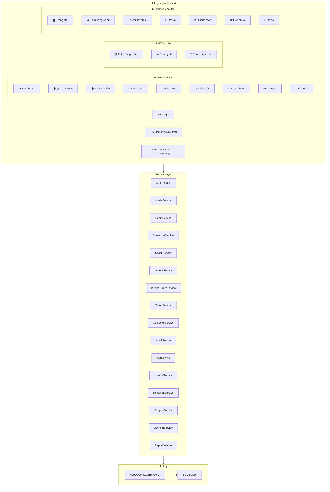

# 🎬 CineManager — Phân Tích Dự Án & Đề Xuất Chức Năng

## 📊 Tổng Quan Kiến Trúc Hiện Tại

---

## 📦 Bảng Tổng Hợp Entities

| Entity | Model | Service | Admin UI | Staff UI | Customer UI |
|--------|-------|---------|----------|----------|-------------|
| User (Admin/Staff) | ✅ | ✅ AuthService | ✅ UcStaffManagement | — | — |
| Movie + Genre | ✅ | ✅ MovieService | ✅ UcMovieManagement | ✅ UcNowShowing | ✅ UcStorefront |
| Room + Seat | ✅ | ✅ RoomService | ✅ UcRoomManagement | — | — |
| Showtime | ✅ | ✅ ShowtimeService | ✅ UcShowtimeManagement | ✅ UcNowShowing | ✅ UcNowShowing |
| Snack | ✅ | ✅ SnackService | ✅ UcSnackManagement | ✅ UcSnackOrder | — |
| Invoice + Ticket | ✅ | ✅ InvoiceService | ✅ UcInvoiceManagement | ✅ (tạo khi checkout) | — |
| InvoiceSnack | ✅ | ✅ (trong InvoiceService) | ✅ (trong hóa đơn) | ✅ (khi checkout) | — |
| Customer | ✅ | ✅ CustomerService | ✅ UcCustomerManagement | ✅ (lookup khi bán vé) | ✅ UcMyProfile |
| PointTransaction | ✅ | ✅ PointService | — (xem trong KH) | ✅ (tích khi checkout) | ✅ (trong hồ sơ) |
| Coupon | ✅ | ✅ CouponService | ✅ UcCouponManagement | — | ✅ DlgCouponRedeem |
| **Voucher** | ✅ | ❌ **Chưa có** | ❌ **Chưa có UI** | ❌ **Chưa áp dụng** | ❌ **Chưa áp dụng** |
| **Shift** | ✅ | ❌ **Chưa có** | ❌ **Chưa có UI** | ❌ **Chưa có UI** | — |
| **Booking** | ✅ | ✅ BookingService | ❌ **Chưa có UI** | — | ✅ UcCustomerBooking |
| **Genre** | ✅ | — (gắn vào Movie) | ❌ **Chưa có CRUD UI** | — | — |

---

## 🔴 Mức 1 — Chức Năng Thiếu Nghiêm Trọng (Đã Có Model Nhưng Chưa Có UI/Service)

### 1. 📋 Quản Lý Voucher (Admin)
> [!IMPORTANT]
> Model `Voucher` đã tồn tại đầy đủ với các field: Code, Type (Percent/Fixed/FreeTicket), Value, MaxDiscount, MaxUses, StartDate, EndDate. Tuy nhiên **chưa có Service nào** và **chưa có giao diện Admin** để CRUD voucher.

**Cần làm:**
- Tạo `VoucherService.cs` (CRUD + validate hạn sử dụng)
- Tạo `UcVoucherManagement.cs` trong `Forms/Admin/Vouchers/`
- Tạo `DlgVoucherEdit.cs` (dialog thêm/sửa)
- Tích hợp áp dụng Voucher vào flow bán vé (`UcSnackOrder.cs` → checkout)

**Effort:** ~3–4 giờ

---

### 2. ⏰ Quản Lý Ca Làm Việc (Shift Management)
> [!IMPORTANT]
> Model `Shift` đã có đầy đủ: OpeningCash, ClosingCash, ExpectedCash, CashDifference, Status (Open/Closed). Tuy nhiên **chưa có Service và UI**. Hiện tại Invoice có field `ShiftId` nhưng luôn = null.

**Cần làm:**
- Tạo `ShiftService.cs` (mở ca, đóng ca, tính tiền)
- Tạo `UcShiftManagement.cs` cho Admin (xem lịch sử ca)
- Thêm nút "Mở ca / Đóng ca" vào giao diện Staff
- Khi bán vé, tự động gắn `ShiftId` vào Invoice

**Effort:** ~4–5 giờ

---

### 3. 🏷️ Quản Lý Thể Loại Phim (Genre CRUD)
> [!WARNING]
> Hiện tại Genre được seed cứng trong `AppDbContext.SeedData()` (8 thể loại). Admin **không thể** thêm/sửa/xóa thể loại từ giao diện.

**Cần làm:**
- Tạo `GenreService.cs`
- Tạo `UcGenreManagement.cs` hoặc tích hợp vào `UcMovieManagement`
- Cho phép Admin thêm thể loại mới (VD: "Tài liệu", "Âm nhạc")

**Effort:** ~1–2 giờ

---

### 4. 🎫 Áp Dụng Voucher/Coupon Khi Checkout (Staff)
> [!WARNING]
> Khi bán vé tại quầy (`UcSnackOrder` → Thanh toán), **không có ô nhập mã Voucher/Coupon**. Dù Model Invoice đã hỗ trợ `VoucherId` và `DiscountAmount`, flow checkout hiện tại bỏ qua hoàn toàn tính năng này.

**Cần làm:**
- Thêm TextBox nhập mã voucher vào `UcSnackOrder.cs` (phần cart bên phải)
- Validate mã voucher → tính giảm giá → cập nhật `lblGrandTotal`
- Khi tạo Invoice, gán `VoucherId` + `DiscountAmount`

**Effort:** ~2–3 giờ

---

### 5. 📋 Admin Xem/Quản Lý Booking Online
> [!NOTE]
> Khách hàng đã có thể đặt vé online qua `UcCustomerBooking` → `UcPaymentGateway`. Tuy nhiên Admin **không có giao diện** để xem, duyệt, hoặc hủy các booking đó.

**Cần làm:**
- Tạo `UcBookingManagement.cs` trong `Forms/Admin/`
- Hiển thị danh sách Booking (lọc theo trạng thái: Pending/Paid/CheckedIn/Cancelled)
- Cho phép Admin duyệt/hủy booking
- Thêm menu "📦 Đặt vé online" vào sidebar Admin

**Effort:** ~3–4 giờ

---

## 🟡 Mức 2 — Nâng Cấp Giá Trị Cao

### 6. 📊 Dashboard Nâng Cao
**Hiện tại Dashboard có:**
- 6 stat cards + biểu đồ doanh thu + top phim + tỷ lệ lấp đầy phòng

**Thiếu:**
- Thống kê **doanh thu bắp nước** riêng (hiện gộp chung)
- Biểu đồ **so sánh doanh thu tuần này vs tuần trước**
- Số **khách hàng mới** trong kỳ
- Tỷ lệ **khách vãng lai vs thành viên**
- **Hóa đơn trung bình** (Average Order Value)

**Effort:** ~3 giờ

---

### 7. 🔍 Tìm Kiếm & Lọc Nâng Cao
**Thiếu ở các màn hình:**

| Màn hình | Hiện tại | Cần thêm |
|----------|----------|----------|
| Quản lý Phim | Không có tìm kiếm | Tìm theo tên, thể loại, trạng thái |
| Quản lý Khách hàng | Không có tìm kiếm | Tìm theo tên, SĐT, hạng, mã thành viên |
| Quản lý Nhân viên | Không có tìm kiếm | Tìm theo tên, vai trò |
| Quản lý Hóa đơn | Không có bộ lọc | Lọc theo ngày, nhân viên, khách hàng |
| Quản lý Bắp nước | Không có tìm kiếm | Tìm theo tên, loại |

**Effort:** ~2–3 giờ (thêm TextBox search + logic filter vào mỗi UC)

---

### 8. 🔔 Hệ Thống Thông Báo (Notification)
- Thông báo khi suất chiếu sắp bắt đầu (trong 30 phút)
- Thông báo khi khách hàng lên hạng
- Thông báo khi voucher sắp hết hạn
- Badge đỏ trên menu item nếu có booking chờ duyệt

**Effort:** ~4–5 giờ

---

### 9. 📤 Xuất Dữ Liệu Excel
**Hiện tại chỉ có xuất PDF cho Dashboard.** Cần thêm:
- Xuất danh sách phim → Excel
- Xuất danh sách khách hàng → Excel  
- Xuất hóa đơn theo khoảng thời gian → Excel
- Xuất doanh thu chi tiết → Excel

**Effort:** ~2–3 giờ (dùng ClosedXML hoặc EPPlus)

---

### 10. 👤 Chỉnh Sửa Thông Tin Nhân Viên
> [!NOTE]
> Hiện tại Admin chỉ có thể: Thêm NV, Reset mật khẩu, Khóa/Mở. **Không thể sửa** tên, SĐT, vai trò của nhân viên đã tồn tại.

**Cần làm:**
- Thêm nút "✏️ Sửa" vào toolbar `UcStaffManagement`
- Tạo `DlgStaffEdit` chế độ Edit (pre-fill data)

**Effort:** ~1 giờ

---

## 🟢 Mức 3 — Tính Năng "Mới Mẻ" & Polish

### 11. 🌙 Hỗ Trợ Giao Diện Sáng/Tối (Theme Toggle)
- Hiện tại ứng dụng chỉ có Dark Theme
- Thêm nút chuyển đổi Light/Dark trong sidebar
- Lưu lựa chọn vào `appsettings.json`

**Effort:** ~5–6 giờ (cần refactor toàn bộ hardcoded color)

---

### 12. 📱 QR Code Check-In
- Staff quét mã QR của booking (từ `BookingCode`) để check-in khách
- Cập nhật booking status từ "Paid" → "CheckedIn"
- Hiển thị thông tin vé ngay khi quét

**Effort:** ~3 giờ

---

### 13. ⭐ Đánh Giá Phim (Movie Review/Rating)
- Khách hàng có thể đánh giá phim sau khi xem (1–5 sao + bình luận)
- Hiển thị rating trung bình trên card phim
- Admin có thể xem/quản lý đánh giá

**Cần thêm:**
- Model: `MovieReview` (CustomerId, MovieId, Rating, Comment, CreatedAt)
- Service: `ReviewService`
- UI Customer: Form đánh giá sau khi xem
- UI Admin: Danh sách đánh giá

**Effort:** ~4–5 giờ

---

### 14. 📊 Lịch Sử Hoạt Động (Audit Log)
- Ghi nhận mọi thao tác quan trọng: tạo/sửa/xóa phim, lịch chiếu, nhân viên
- Admin có thể xem log hoạt động theo thời gian
- Hữu ích cho quản lý và truy vết lỗi

**Cần thêm:**
- Model: `AuditLog` (UserId, Action, EntityType, EntityId, OldValue, NewValue, Timestamp)
- Service: `AuditService`
- UI: `UcAuditLog` cho Admin

**Effort:** ~3–4 giờ

---

### 15. 💬 Gửi Email/SMS Xác Nhận
- Sau khi khách đặt vé online → gửi email xác nhận kèm mã QR
- Nhắc nhở suất chiếu sắp đến (trước 2 giờ)
- Gửi email khi khách lên hạng thành viên

**Effort:** ~4–5 giờ (cần tích hợp SMTP hoặc API)

---

## 📋 Bảng Ưu Tiên Tổng Hợp

| # | Chức năng | Mức ưu tiên | Effort | Lý do |
|---|-----------|-------------|--------|-------|
| 1 | Quản lý Voucher | 🔴 Quan trọng | 3–4h | Model đã có, bỏ phí |
| 2 | Quản lý Ca (Shift) | 🔴 Quan trọng | 4–5h | Model đã có, cần cho nghiệp vụ thực tế |
| 3 | CRUD Thể loại | 🔴 Quan trọng | 1–2h | Đơn giản, thiếu sót cơ bản |
| 4 | Áp dụng Voucher khi checkout | 🔴 Quan trọng | 2–3h | Flow bán vé chưa hoàn chỉnh |
| 5 | Admin quản lý Booking | 🔴 Quan trọng | 3–4h | Booking online không ai duyệt |
| 10 | Sửa thông tin NV | 🟡 Nên có | 1h | Thiếu CRUD cơ bản |
| 7 | Tìm kiếm/Lọc nâng cao | 🟡 Nên có | 2–3h | UX quan trọng |
| 6 | Dashboard nâng cao | 🟡 Nên có | 3h | Thêm chiều sâu phân tích |
| 9 | Xuất Excel | 🟡 Nên có | 2–3h | Nghiệp vụ cần báo cáo |
| 12 | QR Check-In | 🟢 Mới mẻ | 3h | Hiện đại hóa |
| 13 | Đánh giá phim | 🟢 Mới mẻ | 4–5h | Tăng tương tác KH |
| 14 | Audit Log | 🟢 Mới mẻ | 3–4h | Chuyên nghiệp |
| 8 | Notification | 🟢 Mới mẻ | 4–5h | UX tốt hơn |

---

## 🎯 Khuyến Nghị Thứ Tự Triển Khai

> [!TIP]
> **Sprint 1 (Hoàn thiện nền tảng):** #3 Genre CRUD → #1 Voucher Management → #4 Áp dụng Voucher khi checkout → #10 Sửa NV
> 
> **Sprint 2 (Nghiệp vụ hoàn chỉnh):** #2 Shift Management → #5 Booking Management → #7 Search/Filter
> 
> **Sprint 3 (Nâng cao & Mới mẻ):** #6 Dashboard++ → #9 Export Excel → #12 QR Check-In → #13 Movie Reviews

Bạn muốn bắt tay vào phần nào trước?
