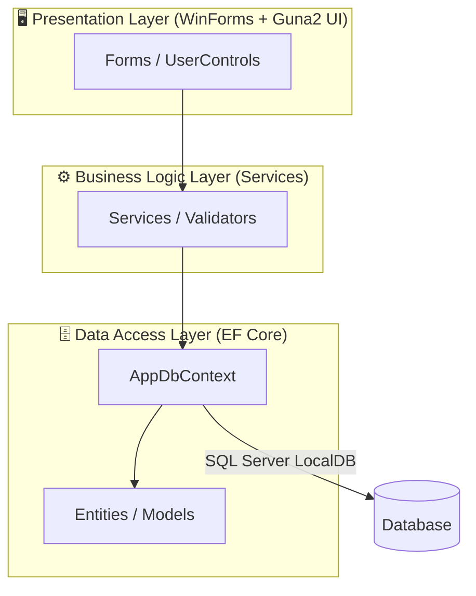
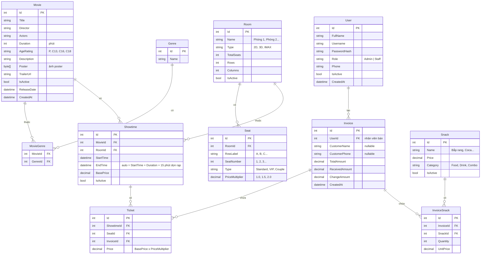
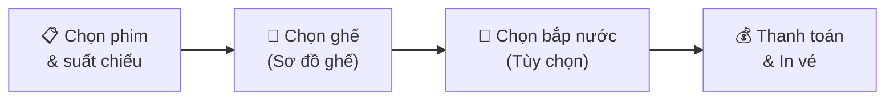

# 🎬 Kế Hoạch Triển Khai: Hệ Thống Quản Lý Lịch Chiếu Phim

> [!NOTE]
> **Dự án:** Bài Tập Lớn .NET — WinForms C# (.NET 10)
> **Ngày tạo:** 03/05/2026

---

## 1. Tổng Quan Kiến Trúc

### 1.1 Kiến trúc 3 lớp (3-Layer Architecture)



> [!TIP]
> Với quy mô bài tập lớn, **không cần dùng Repository Pattern**. EF Core `DbContext` đã là Unit of Work + Repository sẵn. Chỉ cần tổ chức code qua **Service Layer** là đủ gọn gàng và dễ bảo trì.

### 1.2 Công Nghệ Sử Dụng

| Thành phần | Công nghệ | Ghi chú |
|---|---|---|
| **Framework** | .NET 10, WinForms | Đã có sẵn trong project |
| **UI Library** | `Guna.UI2.WinForms` (v2.0.4.7) | Bo góc, gradient, modern controls. Bản trial 14 ngày |
| **ORM** | Entity Framework Core 9+ | Code-First, Migrations |
| **Database** | SQL Server LocalDB | Đi kèm Visual Studio, không cần cài riêng |
| **Biểu đồ** | `LiveChartsCore.SkiaSharpView.WinForms` | Biểu đồ doanh thu, thống kê |
| **Xuất báo cáo** | `ClosedXML` (Excel) hoặc `QuestPDF` (PDF) | Miễn phí, dễ dùng |
| **Hash mật khẩu** | `BCrypt.Net-Next` | Bảo mật tài khoản |
| **Icon** | `IconPacks` hoặc embed SVG/PNG | Từ Material Design Icons |

---

## 2. Thiết Kế Cơ Sở Dữ Liệu

### 2.1 Sơ đồ ERD



### 2.2 Điểm cải thiện so với ý tưởng ban đầu

| Điểm | Ý tưởng ban đầu | Cải thiện |
|---|---|---|
| **Thể loại phim** | Chưa rõ cấu trúc | Tách bảng `Genre` + bảng trung gian `MovieGenre` (quan hệ N-N) |
| **Ghế ngồi** | "Sơ đồ ghế" chung chung | Thiết kế bảng `Seat` với loại ghế (Standard/VIP/Couple) + hệ số giá |
| **Hóa đơn** | Chưa có cấu trúc | Tách `Invoice` (tổng hợp) và `Ticket` (chi tiết từng vé) |
| **Khách hàng** | Chưa đề cập | Lưu tên + SĐT khách trực tiếp trong Invoice (đơn giản, không cần bảng riêng) |
| **Thời gian dọn rạp** | Đề cập nhưng chưa cụ thể | Mặc định 15 phút, `EndTime` tự tính |
| **Độ tuổi phim** | Có nhưng chưa chi tiết | Theo chuẩn phân loại phim VN: P, C13, C16, C18 |

---

## 3. Cấu Trúc Thư Mục Dự Án

```
BaiTapLon/
├── BaiTapLon.slnx
└── BaiTapLon/
    ├── BaiTapLon.csproj
    ├── Program.cs
    ├── appsettings.json                 # Connection string
    │
    ├── Data/
    │   ├── AppDbContext.cs              # EF Core DbContext
    │   └── Migrations/                  # EF Core migrations
    │
    ├── Models/                          # Entity classes
    │   ├── User.cs
    │   ├── Movie.cs
    │   ├── Genre.cs
    │   ├── Room.cs
    │   ├── Seat.cs
    │   ├── Showtime.cs
    │   ├── Invoice.cs
    │   ├── Ticket.cs
    │   ├── Snack.cs
    │   └── InvoiceSnack.cs
    │
    ├── Services/                        # Business Logic
    │   ├── AuthService.cs
    │   ├── MovieService.cs
    │   ├── RoomService.cs
    │   ├── ShowtimeService.cs
    │   ├── TicketService.cs
    │   ├── InvoiceService.cs
    │   ├── SnackService.cs
    │   └── ReportService.cs
    │
    ├── Forms/
    │   ├── FrmLogin.cs                  # Đăng nhập
    │   ├── FrmMain.cs                   # Shell chính (sidebar + content)
    │   ├── Admin/
    │   │   ├── UcMovieManagement.cs     # CRUD Phim
    │   │   ├── UcRoomManagement.cs      # CRUD Phòng chiếu
    │   │   ├── UcShowtimeManagement.cs  # CRUD Lịch chiếu
    │   │   ├── UcStaffManagement.cs     # CRUD Nhân viên
    │   │   ├── UcSnackManagement.cs     # CRUD Đồ ăn
    │   │   └── UcDashboard.cs           # Thống kê + Biểu đồ
    │   └── Staff/
    │       ├── UcNowShowing.cs          # Phim đang chiếu hôm nay
    │       ├── UcSeatSelection.cs       # Sơ đồ ghế
    │       ├── UcSnackOrder.cs          # Chọn bắp nước
    │       └── UcCheckout.cs            # Thanh toán + In vé
    │
    ├── Helpers/
    │   ├── AppConfig.cs                 # Đọc config
    │   ├── SessionManager.cs            # Lưu thông tin user đăng nhập
    │   └── PrintHelper.cs              # Xuất PDF/Excel
    │
    └── Resources/
        ├── Icons/                       # Icon cho sidebar, button
        └── Images/                      # Ảnh mặc định
```

---

## 4. Chi Tiết Chức Năng Theo Role

### 4.1 Màn hình Đăng nhập (`FrmLogin`)

- Giao diện modern với Guna2: bo góc, gradient background
- Nhập Username + Password → xác thực bằng BCrypt
- Phân quyền: chuyển đến giao diện Admin hoặc Staff
- Hiển thị thông báo lỗi khi sai tài khoản

### 4.2 Màn hình chính (`FrmMain`)

- Layout kiểu **Dashboard**: Sidebar cố định bên trái + Panel nội dung bên phải
- Sidebar thay đổi menu tùy theo role (Admin thấy nhiều mục hơn Staff)
- Dùng UserControl swap vào panel nội dung (không mở form mới)
- Header hiển thị: tên user, role, nút đăng xuất

### 4.3 Admin — Quản lý Phim (`UcMovieManagement`)

| Thao tác | Mô tả |
|---|---|
| Xem danh sách | DataGridView với tìm kiếm, lọc theo thể loại, phân trang |
| Thêm phim | Dialog form: tên, đạo diễn, diễn viên, thời lượng, chọn thể loại (CheckedListBox), upload poster |
| Sửa phim | Load dữ liệu vào dialog, cho phép thay đổi |
| Xóa phim | Soft-delete (IsActive = false), không xóa vật lý |

### 4.4 Admin — Quản lý Phòng chiếu (`UcRoomManagement`)

| Thao tác | Mô tả |
|---|---|
| Xem danh sách phòng | Hiển thị tên, loại, số ghế, trạng thái |
| Thêm/Sửa phòng | Nhập tên, loại (2D/3D/IMAX), số hàng × số cột |
| Thiết lập ghế | Auto-generate ghế theo grid (A1→A10, B1→B10...) + cho phép đánh dấu ghế VIP/Couple |

### 4.5 Admin — Quản lý Lịch chiếu (`UcShowtimeManagement`) ⭐ Core

| Thao tác | Mô tả |
|---|---|
| Xem lịch chiếu | Hiển thị dạng **lưới theo ngày** hoặc DataGridView, lọc theo phim/phòng/ngày |
| Thêm lịch chiếu | Chọn Phim → Chọn Phòng → Chọn ngày giờ bắt đầu → Nhập giá vé cơ bản |
| **Validation trùng lịch** | Kiểm tra: `NewStart < ExistingEnd AND NewEnd > ExistingStart` → Báo lỗi trùng |
| **Auto tính EndTime** | `EndTime = StartTime + Movie.Duration + 15 phút` |
| Xóa lịch chiếu | Chỉ cho xóa nếu chưa bán vé nào |

> [!IMPORTANT]
> **Logic chống trùng lịch** là tính năng quan trọng nhất. Công thức kiểm tra:
> ```csharp
> bool isConflict = context.Showtimes.Any(s =>
>     s.RoomId == roomId &&
>     s.Id != currentId &&
>     newStartTime < s.EndTime &&
>     newEndTime > s.StartTime);
> ```

### 4.6 Admin — Quản lý Nhân viên (`UcStaffManagement`)

- CRUD tài khoản nhân viên (chỉ Admin mới được tạo)
- Hash password bằng BCrypt khi tạo mới
- Cho phép reset mật khẩu, vô hiệu hóa tài khoản

### 4.7 Admin — Quản lý Đồ ăn (`UcSnackManagement`)

- CRUD: tên, giá, phân loại (Food/Drink/Combo)
- Soft-delete

### 4.8 Admin — Thống kê & Báo cáo (`UcDashboard`)

| Biểu đồ | Loại | Mô tả |
|---|---|---|
| Doanh thu theo ngày/tuần/tháng | Column Chart | Lọc theo khoảng thời gian |
| Top 5 phim ăn khách | Bar Chart | Dựa trên số vé bán |
| Tỷ lệ lấp đầy phòng chiếu | Pie Chart | % ghế đã bán / tổng ghế |
| Doanh thu bắp nước | Line Chart | Trend theo thời gian |

- Dùng **LiveCharts2** để render
- Xuất báo cáo ra **Excel** (ClosedXML) hoặc **PDF** (QuestPDF)

### 4.9 Staff — Bán vé (`UcNowShowing` → `UcSeatSelection` → `UcCheckout`)

**Luồng bán vé:**



**Chi tiết từng bước:**

1. **Chọn phim & suất chiếu** (`UcNowShowing`):
   - Hiển thị danh sách phim đang chiếu dạng **Card** (poster + tên + thời lượng + rating)
   - Click vào phim → hiển thị các suất chiếu trong ngày
   - Chọn suất chiếu → chuyển sang chọn ghế

2. **Sơ đồ ghế** (`UcSeatSelection`):
   - Render grid ghế bằng các `Guna2Button` dynamic
   - Màu sắc: ⬜ Trống | 🟦 Đang chọn | 🟥 Đã bán | 🟨 VIP | 🟪 Couple
   - Click để chọn/bỏ chọn, hiển thị tổng tiền realtime
   - Kiểm tra trạng thái ghế từ DB trước khi cho chọn

3. **Chọn bắp nước** (`UcSnackOrder`):
   - Danh sách combo/đồ ăn dạng card
   - Nút +/- để chọn số lượng
   - Tổng tiền bắp nước cộng dồn vào hóa đơn

4. **Thanh toán** (`UcCheckout`):
   - Tóm tắt: Phim, suất chiếu, ghế đã chọn, bắp nước
   - Nhập tên + SĐT khách (tùy chọn)
   - Nhập tiền khách đưa → auto tính tiền thối
   - Bấm "Thanh toán" → Lưu Invoice + Tickets + InvoiceSnacks
   - Xuất hóa đơn (PDF hoặc in trực tiếp)

---

## 5. NuGet Packages Cần Cài

```powershell
# UI hiện đại
dotnet add package Guna.UI2.WinForms

# ORM + Database
dotnet add package Microsoft.EntityFrameworkCore
dotnet add package Microsoft.EntityFrameworkCore.SqlServer
dotnet add package Microsoft.EntityFrameworkCore.Tools

# Biểu đồ
dotnet add package LiveChartsCore.SkiaSharpView.WinForms

# Xuất báo cáo
dotnet add package ClosedXML          # Excel
dotnet add package QuestPDF           # PDF

# Bảo mật
dotnet add package BCrypt.Net-Next

# Configuration
dotnet add package Microsoft.Extensions.Configuration
dotnet add package Microsoft.Extensions.Configuration.Json
```

---

## 6. Lộ Trình Phát Triển (5 Phases)

### Phase 1: Nền tảng (3-4 ngày)
- [x] Tạo project WinForms .NET 10
- [ ] Cài đặt NuGet packages
- [ ] Tạo Models (Entity classes) + `AppDbContext`
- [ ] Cấu hình `appsettings.json` (connection string)
- [ ] Chạy Migration đầu tiên, seed dữ liệu mẫu (admin account, genres, sample rooms)
- [ ] Tạo `FrmLogin` + `AuthService` (đăng nhập + BCrypt)
- [ ] Tạo `FrmMain` (layout sidebar + content panel)

### Phase 2: Module Admin CRUD (5-6 ngày)
- [ ] `UcMovieManagement` + `MovieService` (CRUD phim, upload poster)
- [ ] `UcRoomManagement` + `RoomService` (CRUD phòng, auto-generate ghế)
- [ ] `UcShowtimeManagement` + `ShowtimeService` (**logic chống trùng lịch**)
- [ ] `UcStaffManagement` + (tái sử dụng `AuthService`)
- [ ] `UcSnackManagement` + `SnackService`

### Phase 3: Module Bán Vé (4-5 ngày)
- [ ] `UcNowShowing` (hiển thị phim + suất chiếu theo ngày)
- [ ] `UcSeatSelection` (render sơ đồ ghế dynamic, logic chọn ghế)
- [ ] `UcSnackOrder` (chọn bắp nước)
- [ ] `UcCheckout` + `InvoiceService` (thanh toán, lưu hóa đơn)

### Phase 4: Thống Kê & Báo Cáo (2-3 ngày)
- [ ] `UcDashboard` + `ReportService`
- [ ] Tích hợp LiveCharts2 (doanh thu, top phim, tỷ lệ lấp đầy)
- [ ] Xuất Excel/PDF

### Phase 5: Hoàn Thiện & Polish (2-3 ngày)
- [ ] Test toàn bộ luồng nghiệp vụ
- [ ] Fix bug, xử lý edge cases
- [ ] Seed dữ liệu demo đẹp (phim thật, poster thật)
- [ ] Viết tài liệu hướng dẫn sử dụng (nếu cần)

> **Tổng ước tính: ~16-21 ngày**

---

## 7. Những Điểm Cải Thiện So Với Ý Tưởng Ban Đầu

### ✅ Giữ nguyên (tốt rồi)
- Phân quyền Admin/Staff
- Logic chống trùng lịch chiếu
- Sơ đồ ghế trực quan
- Tích hợp bắp nước vào hóa đơn
- Dùng LiveCharts cho thống kê

### 🔧 Cải thiện

| # | Vấn đề | Giải pháp |
|---|---|---|
| 1 | Chưa có cấu trúc DB rõ ràng | Thiết kế ERD đầy đủ với quan hệ N-N cho thể loại |
| 2 | Ghế ngồi chưa phân loại | Thêm loại ghế Standard/VIP/Couple với hệ số giá |
| 3 | Chưa có cơ chế hash password | Dùng BCrypt thay vì lưu plain text |
| 4 | Crystal Reports phức tạp, cũ | Thay bằng QuestPDF (miễn phí, code-first, dễ dùng) |
| 5 | Chưa đề cập soft-delete | Tất cả entity chính đều có `IsActive` flag |
| 6 | Thiếu cấu trúc project | Tổ chức rõ ràng: Models / Services / Forms / Helpers |
| 7 | Chưa đề cập Dependency Injection | Có thể dùng `Microsoft.Extensions.DependencyInjection` trong `Program.cs` |

### ❌ Loại bỏ / Đơn giản hóa
- **Cụm rạp (Cinema Complex)**: Với bài tập lớn, chỉ cần 1 rạp với nhiều phòng chiếu là đủ. Quản lý multi-cinema sẽ quá phức tạp.
- **Realtime cập nhật ghế**: Không cần SignalR/WebSocket cho WinForms desktop. Chỉ cần reload trạng thái ghế từ DB mỗi khi mở sơ đồ ghế là đủ.

---

## 8. Câu Hỏi Cần Xác Nhận

> [!WARNING]
> Trước khi bắt đầu code, hãy trả lời các câu hỏi sau:

1. **Database**: Bạn muốn dùng **SQL Server LocalDB** (đi kèm VS) hay **SQL Server Express** (cài riêng)?
2. **Guna2 UI**: Bạn đã có license hay dùng bản trial 14 ngày? Nếu không muốn dùng Guna2, mình có thể tự custom control bằng GDI+ (tốn thời gian hơn nhưng miễn phí).
3. **Scope**: Bạn có muốn giữ tính năng **bắp nước** không? Nếu thời gian gấp, có thể bỏ Phase này để tập trung vào core (quản lý phim + lịch chiếu + bán vé).
4. **Xuất báo cáo**: Bạn cần xuất **Excel**, **PDF**, hay cả hai?
5. **Deadline**: Bạn có bao nhiêu thời gian để hoàn thành?
